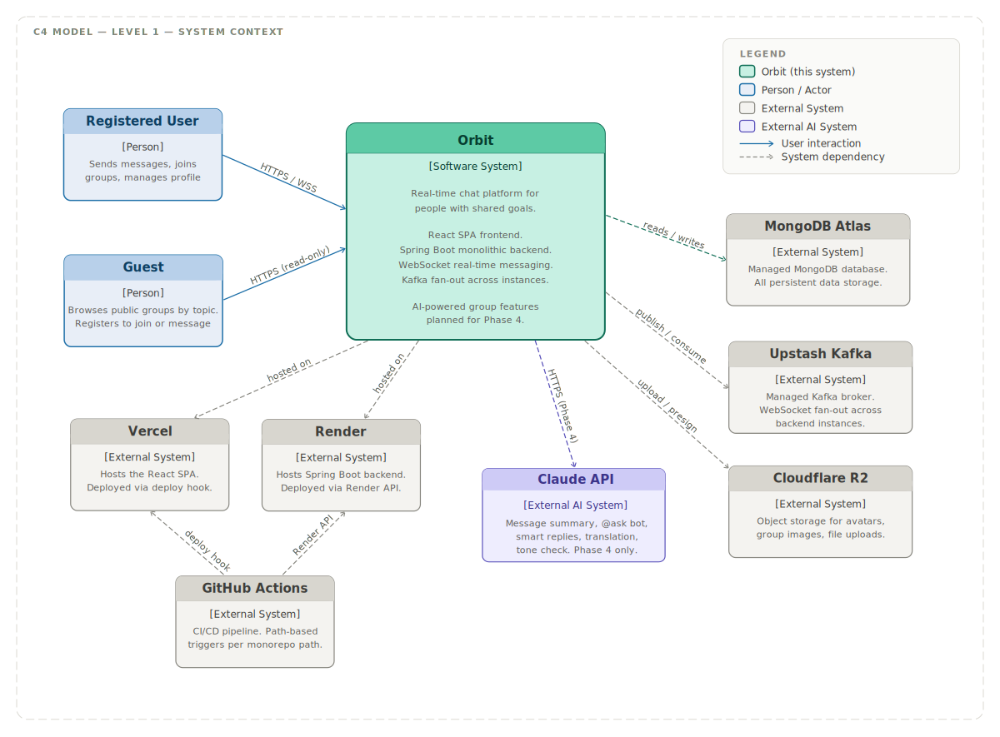

# C1 — System Context

> **C4 Model Level 1 — System Context**  
> Audience: Everyone, including non-technical stakeholders. This is the highest-level view of Orbit — what the system is, who uses it, and what external systems it depends on.

---

## Diagram

---

## What Is Orbit

Orbit is a real-time chat platform for people who connect over shared professional goals — career switchers, interview preppers, learners, and builders. It provides 1:1 direct messaging, interest-based group chats with public discovery, and AI-powered group intelligence features planned for Phase 4.

The system consists of a React SPA frontend deployed on Vercel and a modular monolithic Spring Boot backend deployed on Render. All real-time communication runs over WebSockets using the STOMP protocol, with Kafka handling message fan-out across backend instances for horizontal scalability.

---

## Actors

### Registered User
A person with a verified account on Orbit. Interacts with the system over HTTPS for REST operations and WSS (WebSocket Secure) for real-time messaging. Can send and receive messages, manage contacts, create and join groups, upload files, and use AI features once Phase 4 is complete.

### Guest
A person who has not yet created an account. Can browse public groups and filter by topic tag without registering — a read-only view of the group discovery feed. This supports a natural onboarding funnel: a guest finds an active group relevant to their goals, then registers to join and participate. Must authenticate before sending any message, joining a group, or accessing any other feature.

---

## External Systems

### MongoDB Atlas
Managed MongoDB database hosted on Atlas free tier (M0 cluster). Stores all persistent data for Orbit — users, contacts, groups, conversations, messages, and notifications. Orbit's Spring Boot backend connects via the `mongodb+srv://` protocol. Data is encrypted at rest by Atlas by default.

### Upstash Kafka
Serverless managed Kafka broker. Used for WebSocket fan-out — when a message arrives at one backend instance, it is published to a Kafka topic and consumed by all running instances, each of which delivers the message to any WebSocket sessions it holds. This makes the monolithic backend horizontally scalable without microservices. Three topics are used: `chat.messages`, `chat.presence`, and `chat.notifications`.

### Cloudflare R2
S3-compatible object storage used for all binary content — user avatars, group avatars, group cover images, and file and image message attachments. Files are uploaded from the backend directly to R2. Access is via presigned URLs that expire after one hour, preventing unauthorised direct access. Introduced in Phase 2 (avatars) and Phase 3 (file uploads).

### Claude API (Anthropic)
Large language model API used exclusively for Phase 4 AI features. The backend makes stateless HTTPS calls to the API, passing message context as input and receiving responses to display as bot messages in conversations. Features include `/summary` catch-up, `@ask` group assistant, smart reply suggestions, message translation, and tone checking. Not used in Phases 1–3. Server-side access to message content is required for all AI features, which is the reason end-to-end encryption is not implemented — see `discussions/004_e2ee_vs_ai_features.md`.

### Vercel
Frontend hosting platform. Serves the compiled React SPA as a global CDN-backed static deployment. Automatic Git deployment is disabled — deployments are triggered exclusively via a Vercel Deploy Hook called from the GitHub Actions frontend pipeline. This prevents race conditions between Vercel's auto-deploy and the CI pipeline.

### Render
Backend hosting platform. Runs the Spring Boot JAR as a web service on the free tier. Provides 512MB RAM and 750 hours per month. The instance spins down after 15 minutes of inactivity — a known free tier behaviour documented in `DEPLOYMENT.md`. Deployments are triggered via the Render API from the GitHub Actions backend pipeline.

### GitHub Actions
CI/CD pipeline runner hosted by GitHub. Two independent workflows exist — one scoped to `backend/**` changes and one scoped to `frontend/**` changes — using path-based filters so changes in one do not trigger the other. The backend workflow builds, tests, and deploys to Render. The frontend workflow builds and deploys to Vercel via deploy hook.

---

## Key Interactions

| From            | To            | How                       | Purpose                                                     |
|-----------------|---------------|---------------------------|-------------------------------------------------------------|
| Registered User | Orbit         | HTTPS / WSS               | All app interactions — messaging, groups, profile           |
| Guest           | Orbit         | HTTPS (read-only)         | Browse public groups by topic, then register to participate |
| Orbit           | MongoDB Atlas | mongodb+srv               | Read and write all application data                         |
| Orbit           | Upstash Kafka | Kafka protocol (SASL/SSL) | Publish and consume WebSocket fan-out events                |
| Orbit           | Cloudflare R2 | HTTPS (AWS S3 SDK)        | Upload files, generate presigned download URLs              |
| Orbit           | Claude API    | HTTPS                     | AI feature requests (Phase 4 only)                          |
| Orbit           | Vercel        | CDN delivery              | Serves the React SPA to browsers                            |
| Orbit           | Render        | Runtime host              | Runs the Spring Boot backend process                        |
| GitHub Actions  | Vercel        | HTTPS deploy hook         | Trigger frontend deployment after CI passes                 |
| GitHub Actions  | Render        | HTTPS Render API          | Trigger backend deployment after CI passes                  |

---

## Security Boundary Notes

All external communication uses TLS — HTTPS for REST and AI API calls, WSS for WebSocket connections, and the `mongodb+srv://` protocol which enforces TLS by default. Cloudflare R2 files are served via expiring presigned URLs rather than public permanent URLs, limiting unauthorised access to uploaded content. JWT access tokens (15-minute expiry) and refresh tokens (7-day expiry) govern all authenticated sessions.

The Claude API receives message content as part of AI feature requests. This is the boundary at which user message data leaves the Orbit system. This tradeoff is explicitly documented and accepted — see `discussions/004_e2ee_vs_ai_features.md`.

---

## What This Diagram Does Not Show

The C1 diagram intentionally omits internal implementation details. The following are covered in subsequent C4 levels:

- How the React frontend and Spring Boot backend are structured internally → `c2_container.md`
- How the Spring Boot application is organised into internal packages → `c3_component.md`
- How specific flows like WebSocket connection and message delivery work → `sequences/`
