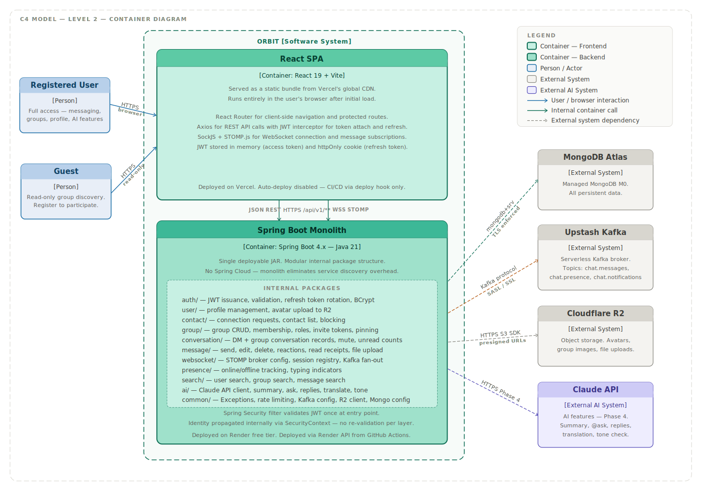

# C2 — Container Diagram

> **C4 Model Level 2 — Container Diagram**  
> Audience: Developers, DevOps engineers, and architects. This diagram zooms into Orbit and shows the two deployable containers that make up the system, how they communicate with each other, and how they depend on external systems.

---

## Diagram

---

## What Is a Container

In C4 terminology, a container is any separately runnable or deployable unit — a web application, a mobile app, a server-side API, a database, or a serverless function. It is not a Docker container specifically. Orbit has two containers: the React SPA and the Spring Boot monolith. Everything else shown in the diagram is an external system that Orbit depends on.

---

## Containers

### React SPA
**Technology:** React 19, Vite, React Router, Axios, SockJS + STOMP.js  
**Deployed on:** Vercel (global CDN)  
**Port:** None — served as static assets, runs in the browser

The React SPA is compiled by Vite into a static bundle of HTML, CSS, and JavaScript and served from Vercel's global CDN. After the initial load, the app runs entirely in the user's browser with no server-side rendering involved.

**Responsibilities:**
- Client-side routing and protected route enforcement via React Router
- JWT access token management — stored in memory (not localStorage) to prevent XSS exposure
- Refresh token management — stored in an httpOnly cookie, sent automatically on refresh calls
- REST API calls via Axios with a request interceptor that attaches the Bearer token to every outgoing request and a response interceptor that handles 401 responses by transparently refreshing the token and retrying the original request
- WebSocket connection management via SockJS + STOMP.js — connects on login, subscribes to conversation and presence topics, reconnects automatically on disconnect
- Real-time UI updates driven by incoming STOMP frame events — new messages, typing indicators, reactions, read receipts, presence changes
- Optimistic UI updates for message send — message appears instantly in the UI before server confirmation, rolled back on failure

**Deployment notes:** Vercel's automatic Git deployment is disabled via `vercel.json`. All deployments are triggered exclusively by the GitHub Actions frontend pipeline via a Vercel Deploy Hook after the build passes. This prevents race conditions between Vercel's auto-deploy and the CI pipeline.

---

### Spring Boot Monolith
**Technology:** Spring Boot 4.x, Java 21, Spring WebSocket + STOMP, Spring Security, Spring Data MongoDB, Spring Kafka
**Deployed on:** Render (free tier web service)
**Port:** 8080 (local), assigned by Render in production

The Spring Boot application is the single backend container for Orbit. It is a modular monolith — one deployable JAR organised into clean internal packages. There is no Spring Cloud, no service discovery, and no API gateway. All backend responsibilities are handled by this one process.

**Responsibilities:**
- REST API serving all application endpoints under `/api/v1/`
- WebSocket server via Spring's STOMP broker — accepts connections, manages subscriptions, routes messages to `/topic/` and `/user/queue/` destinations
- JWT validation at the Spring Security filter chain entry point — validated once per request, identity propagated internally via SecurityContext. No re-validation at service or repository layer
- Kafka producer — publishes message events to `chat.messages`, presence events to `chat.presence`, and (Phase 2 only) notification events to `chat.notifications` for real-time unread-count push
- Kafka consumer — consumes from all three topics and delivers events to relevant WebSocket sessions held by this instance
- MongoDB data access via Spring Data MongoDB repositories and aggregation pipelines
- File upload handling — receives multipart requests, streams files to Cloudflare R2 via the AWS S3 SDK, stores presigned URL metadata on the message document
- AI feature handling — constructs prompts from conversation context, calls the Claude API, broadcasts responses as bot messages via WebSocket
- Rate limiting — token bucket strategy per authenticated user applied at the controller layer
- Schema validation — MongoDB JSON Schema validators applied at startup via a MigrationService component

**Internal package structure:**

| Package | Responsibility |
|---|---|
| `auth/` | JWT issuance, validation, refresh token rotation, BCrypt password hashing |
| `user/` | Profile management, avatar upload coordination with R2 |
| `contact/` | Connection requests, contact list, blocking |
| `group/` | Group CRUD, membership management, roles, invite token generation, message pinning |
| `conversation/` | DM and group conversation records, mute state, unread count coordination |
| `message/` | Message send, edit, soft delete, reactions, read receipts, file message handling |
| `websocket/` | STOMP broker configuration, WebSocket session registry, Kafka fan-out coordination |
| `presence/` | Online/offline tracking via WebSocket lifecycle events, typing indicator handling |
| `search/` | User search, public group search, in-conversation message search |
| `ai/` | Claude API client, prompt construction, all five AI feature handlers |
| `common/` | Exception handling, Kafka producer config, R2 storage client, schema migration, bot user seeding, Mongo config |

**Deployment notes:** Deployed on Render's free tier with 512MB RAM. The instance spins down after 15 minutes of inactivity — first request after spin-down triggers a 30–60 second cold start. Deployments are triggered via the Render API from the GitHub Actions backend pipeline after build and tests pass. See `DEPLOYMENT.md` for full setup instructions.

---

## Communication Protocols

| From | To | Protocol | Details |
|---|---|---|---|
| Browser | React SPA | HTTPS | Static asset delivery from Vercel CDN |
| Registered User | React SPA | HTTPS + WSS | REST calls and WebSocket for real-time |
| Guest | React SPA | HTTPS | Read-only group discovery, registration, login |
| React SPA | Spring Boot | HTTPS `/api/v1/**` | REST — JSON request/response, Bearer token auth |
| React SPA | Spring Boot | WSS `/ws` | WebSocket — STOMP over SockJS, JWT on connect |
| Spring Boot | MongoDB Atlas | `mongodb+srv://` | TLS enforced by protocol, SCRAM-SHA-256 auth |
| Spring Boot | Upstash Kafka | Kafka native protocol | SASL/SSL — username and password from Upstash console |
| Spring Boot | Cloudflare R2 | HTTPS | AWS S3 SDK compatible — upload and presigned URL generation |
| Spring Boot | Claude API | HTTPS | REST — Anthropic API key in Authorization header, Phase 4 only |

---

## WebSocket Architecture Detail

The WebSocket implementation is the most architecturally significant part of the system and worth understanding at this level.

**Connection flow:** The React SPA connects to `wss://api.orbit.onrender.com/ws?token=<jwt>` via SockJS. The Spring Boot backend validates the JWT on the initial HTTP upgrade handshake. Once connected, the client subscribes to STOMP destinations for each conversation it participates in.

**Fan-out via Kafka:** When a message is sent over WebSocket or REST, Spring Boot persists it to MongoDB immediately, then publishes a `chat.messages` event to Upstash Kafka. All running backend instances consume from this topic. Each instance checks whether it holds any WebSocket sessions for the message recipients and delivers accordingly. This means the backend is horizontally scalable — adding more Render instances requires no code changes.

**Private vs shared destinations:**
- `/topic/conversations/{id}/**` — shared topic, all subscribers in a conversation receive the event
- `/user/queue/notifications` — private queue, only the authenticated user receives the event via Spring's `convertAndSendToUser`

**Reconnection:** SockJS handles automatic reconnection on dropped connections. The React SPA resubscribes to all previous STOMP destinations after reconnect. If the access token has expired during the disconnect, the SPA refreshes it before reconnecting.

---

## Data Ownership

All persistent data is owned by the Spring Boot monolith and stored in MongoDB Atlas. The React SPA holds no persistent state — it is stateless between sessions. File binaries are stored in Cloudflare R2 with metadata references held in MongoDB message documents.

---

## Security Notes

- JWT access tokens are stored in React memory only — not in localStorage or sessionStorage — to prevent XSS-based token theft
- Refresh tokens are stored in httpOnly cookies, inaccessible to JavaScript
- Cloudflare R2 files are never publicly accessible by permanent URL — all access is via presigned URLs with a 1-hour expiry
- The Spring Boot backend enforces CORS to allow requests only from the known Vercel frontend origin
- All external connections (MongoDB, Kafka, R2, Claude API) use TLS

---

## What This Diagram Does Not Show

The internal package structure of the Spring Boot monolith is shown at a high level here but detailed in the next C4 level. How specific flows work end-to-end — WebSocket connection lifecycle, message send flow, AI feature flow — are covered in the sequence diagrams under `sequences/`.
