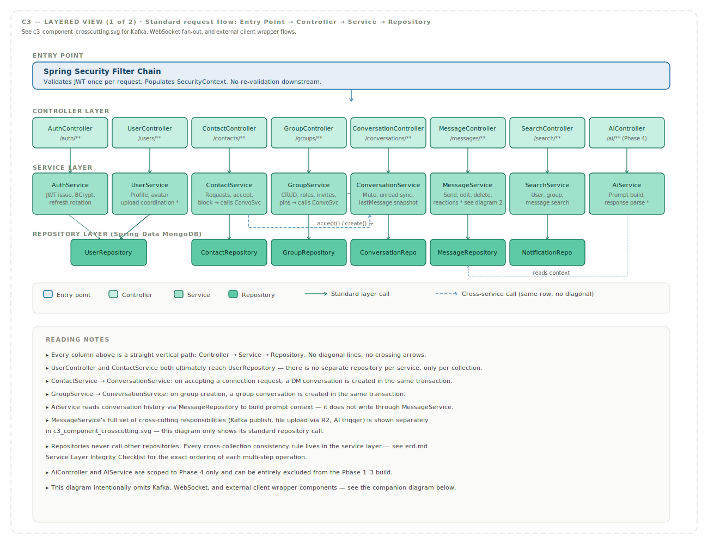
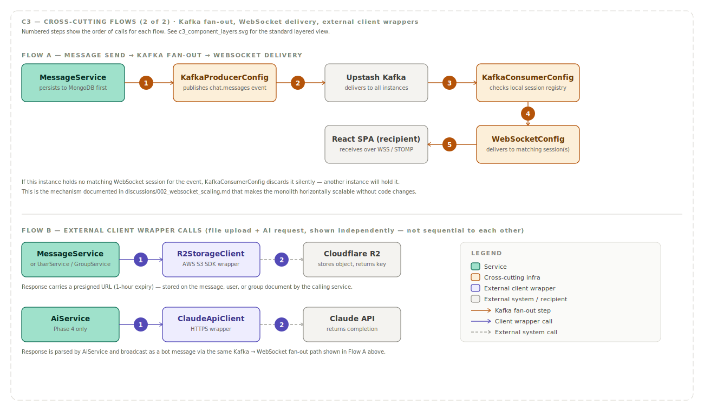

# C3 — Component Diagram

> **C4 Model Level 3 — Component Diagram**  
> Audience: Developers implementing the Spring Boot monolith. This is the most detailed architectural view in the documentation set and serves as the direct blueprint for package and class structure during the build phase.

---

## Diagram





---

## Scope

This document zooms into the single Spring Boot Monolith container described in `c2_container.md` and shows its internal components — controllers, services, repositories, and cross-cutting infrastructure — along with how they call each other and which external systems they ultimately depend on.

Every component shown here corresponds to a real class or set of classes to be implemented. This document should be treated as the working reference while writing the backend, not just a planning artifact.

---

## Layered Architecture

Orbit's Spring Boot backend follows a standard four-layer architecture, with cross-cutting infrastructure components sitting alongside rather than within this stack.

```
Entry Point  →  Controller  →  Service  →  Repository  →  MongoDB
                                  ↓
                         Cross-cutting infra
                    (Kafka, WebSocket, R2, Claude API)
```

### Layer Rules

These rules are enforced by convention across the codebase and are important to follow consistently during implementation:

- Controllers depend only on their corresponding service. A controller never calls a repository directly.
- Services may call other services when an operation spans multiple domains — for example, `ContactService` calls `ConversationService` when a connection request is accepted, since a DM conversation must be created atomically alongside the contact status update.
- Repositories never call other repositories. Any cross-collection consistency logic lives in the service layer, never the data access layer.
- Multi-document MongoDB transactions are initiated at the service layer only, never inside a controller.
- Identity flows downward from the Security Filter Chain via Spring's `SecurityContext`. No controller or service re-parses or re-validates the JWT — this was established in `TECH_STACK.md` and is enforced structurally here.

---

## Entry Point

### Spring Security Filter Chain
Validates the JWT bearer token once per incoming request, before the request reaches any controller. On success, populates the `SecurityContext` with the authenticated user's identity, which is then accessible throughout the request via `@AuthenticationPrincipal` or `SecurityContextHolder`. On failure, short-circuits with a 401 response using the standard error envelope from `API_CONTRACTS.md`.

For WebSocket connections, a separate handshake interceptor performs the same JWT validation during the SockJS/STOMP connection upgrade, since WebSocket connections do not pass through the standard HTTP filter chain in the same way.

---

## Controller Layer

Each controller maps to one resource group from `API_CONTRACTS.md` and contains no business logic — its only responsibilities are request validation (via `@Valid` and Bean Validation annotations), delegating to the matching service, and shaping the HTTP response.

| Controller | Endpoints | Calls |
|---|---|---|
| `AuthController` | `/api/v1/auth/**` | `AuthService` |
| `UserController` | `/api/v1/users/**` | `UserService` |
| `ContactController` | `/api/v1/contacts/**` | `ContactService` |
| `GroupController` | `/api/v1/groups/**` | `GroupService` |
| `ConversationController` | `/api/v1/conversations/**` | `ConversationService` |
| `MessageController` | `/api/v1/conversations/{id}/messages/**` | `MessageService` |
| `SearchController` | `/api/v1/search/**` | `SearchService` |
| `AiController` | `/api/v1/ai/**` (Phase 4 only) | `AiService` |

---

## Service Layer

The service layer contains all business logic, validation beyond basic field constraints, and orchestration across repositories and cross-cutting infrastructure. This is where the integrity rules documented in `erd.md` are actually implemented.

### AuthService
Handles registration, login, JWT issuance, and refresh token rotation. Uses BCrypt with cost factor 12 for password hashing, as specified in `TECH_STACK.md`. Calls `UserRepository` to persist new users and validate credentials on login.

### UserService
Manages profile updates and coordinates avatar uploads. Delegates the actual file transfer to `R2StorageClient` and stores the resulting URL on the user document via `UserRepository`.

### ContactService
Handles connection requests, acceptance, decline, and blocking. On acceptance, calls `ConversationService` to create the DM conversation document as part of the same logical operation — implemented as a MongoDB multi-document transaction per the integrity rules in `erd.md`.

### GroupService
Handles group CRUD, membership changes, role promotion and demotion, invite token generation and validation, and message pinning. Enforces the admin-promotion-on-last-admin-leaving rule documented in the ERD's Service Layer Integrity Checklist.

### ConversationService
Manages conversation-level state — mute status, the denormalised `lastMessage` snapshot, and keeping `participantIds` in sync with group membership changes. Called by both `ContactService` and `GroupService` during creation flows, and by `MessageService` whenever a new message is sent.

### MessageService
The busiest service in the system. Handles message send, edit, soft delete, reactions (using the `$pull` then `$push` pattern documented in `erd.md` to enforce one reaction per user), and read receipts. On every send, it publishes an event to `KafkaProducerConfig` for WebSocket fan-out and triggers `ConversationService` to update the `lastMessage` snapshot. For file and image messages, it delegates the actual upload to `R2StorageClient` before persisting the message document.

### SearchService
Handles user search by display name, public group search and discovery filtering, and in-conversation message search using MongoDB text indexes as defined in `erd.md`.

### AiService
Isolated entirely to Phase 4. Constructs prompts from conversation context retrieved via `MessageRepository`, calls `ClaudeApiClient`, and parses responses for each of the five AI features. Because this service and its controller are cleanly isolated, the entire AI layer can be excluded from the build in Phases 1 through 3 without affecting any other component.

---

## Repository Layer

Thin Spring Data MongoDB repository interfaces, each corresponding to one collection defined in `erd.md`. Custom query methods and aggregation pipelines live here, but no business logic.

| Repository | Collection | Notable Queries |
|---|---|---|
| `UserRepository` | `users` | `findByEmail`, text search on `displayName` |
| `ContactRepository` | `contacts` | Compound query for bidirectional contact lookup |
| `GroupRepository` | `groups` | Discovery query filtering by `visibility` + `topicTag` |
| `ConversationRepository` | `conversations` | `findByParticipantIdsContaining`, DM lookup by participant pair |
| `MessageRepository` | `messages` | Cursor-based pagination using `conversationId` + `_id`, text search scoped to `conversationId` |
| `NotificationRepository` | `notifications` | `findByUserIdAndReadFalse`, upsert by `userId` + `conversationId` |

---

## Cross-Cutting Infrastructure

These components are not part of the standard request layer stack but are used by services as needed.

### WebSocketConfig
Configures the STOMP message broker, registers the `/ws` endpoint with SockJS fallback, defines the `/topic` and `/user/queue` destination prefixes, and maintains the session registry used to determine which WebSocket sessions are held by this specific backend instance.

### KafkaProducerConfig
Publishes events to the three Kafka topics defined in `TECH_STACK.md` and `DEPLOYMENT.md` — `chat.messages`, `chat.presence`, and `chat.notifications`. Called by `MessageService` on every send and by the presence-handling logic on typing and online/offline state changes.

### KafkaConsumerConfig
Consumes from all three Kafka topics. For each event, checks the local session registry maintained by `WebSocketConfig` and delivers to any matching sessions held by this instance. This is the component that implements the horizontal scaling solution documented in `discussions/002_websocket_scaling.md`.

### RateLimitFilter
Applies the token bucket rate limits defined in `API_CONTRACTS.md`, scoped per authenticated user and per endpoint group. Sits in the filter chain ahead of all controllers.

### GlobalExceptionHandler
A `@RestControllerAdvice` component that catches exceptions thrown anywhere in the controller or service layers and converts them into the standard error envelope defined in `API_CONTRACTS.md`, ensuring consistent error responses across every endpoint without each controller needing its own try-catch handling.

### MigrationService
Runs on application startup. Applies the MongoDB JSON Schema validators and creates the indexes defined in `erd.md` and `DEPLOYMENT.md`. Ensures a fresh environment — local Docker or a new Atlas cluster — is correctly configured without manual intervention.

---

## External Client Wrappers

These components isolate all interaction with a specific external system behind a single class, so the rest of the codebase never imports a third-party SDK directly.

### R2StorageClient
Wraps the AWS S3 SDK configured for Cloudflare R2's S3-compatible endpoint. Provides upload and presigned URL generation methods. Used by `UserService` for avatars, `GroupService` for group avatars and cover images, and `MessageService` for file and image message attachments.

### ClaudeApiClient
Wraps HTTPS calls to the Anthropic Messages API. Used exclusively by `AiService`. Isolating this in its own client class means the Claude API integration can be unit tested independently with a mocked client, and means the rest of the codebase has zero direct dependency on Anthropic's SDK or request format.

---

## External Systems Referenced

| External System | Accessed By |
|---|---|
| MongoDB Atlas | All repository classes |
| Upstash Kafka | `KafkaProducerConfig`, `KafkaConsumerConfig` |
| Cloudflare R2 | `R2StorageClient` |
| Claude API | `ClaudeApiClient` |

---

## Design Notes

A few points worth keeping in mind while implementing against this structure:

The AI layer's isolation is deliberate and important — `AiController`, `AiService`, and `ClaudeApiClient` should be implementable, and excludable, as a self-contained unit. This directly supports the phased build approach where Phase 4 is the final addition with zero risk of disrupting Phases 1 through 3.

`MessageService` is intentionally the most complex service because messaging is the core domain of the application. If it grows large enough to become unwieldy, splitting it into `MessageService` (core CRUD) and `MessageReactionService` / `MessageReadReceiptService` is a reasonable future refactor — but start with one service and split only if it proves necessary.

The repository-never-calls-repository rule exists specifically to keep the referential integrity logic centralised, since MongoDB itself enforces none of it. Every place where a service touches more than one repository is a place where the integrity rules from `erd.md`'s Service Layer Integrity Checklist must be followed precisely.

---

## What This Diagram Does Not Show

Class-level detail — specific method signatures, DTO shapes, and exact field mappings — is intentionally left out of this document. Those are implementation details that belong in code and Javadoc, not architecture documentation. The next level of detail beyond this document is the sequence diagrams under `sequences/`, which show how these components interact over time for specific flows like WebSocket connection and message delivery.
