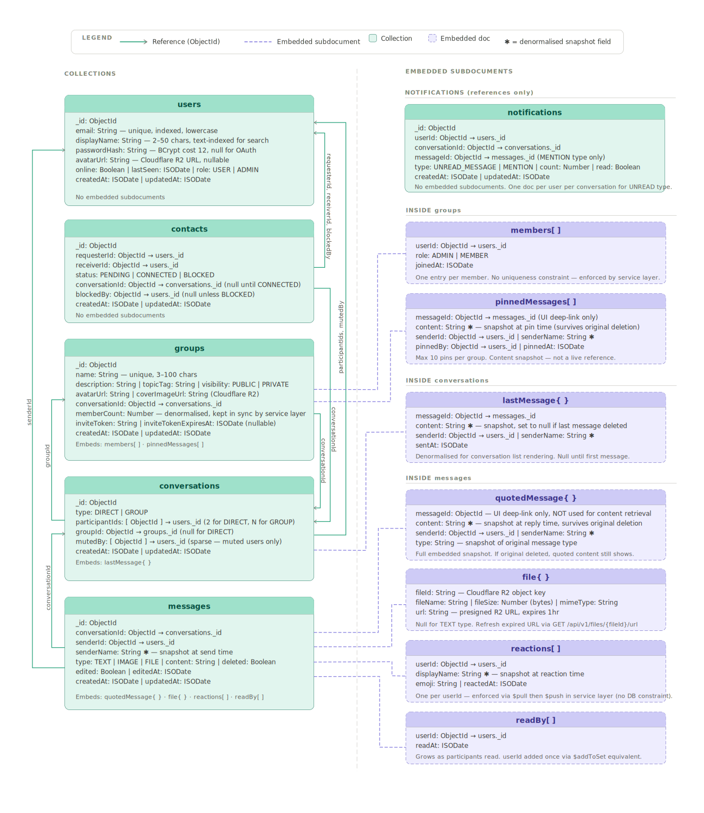

# Entity Relationship Document — Orbit

Orbit uses **pure MongoDB** for all persistent data storage. This document defines every collection, every field, its type, constraints, and how collections reference each other.

Since MongoDB has no foreign key constraints, referential integrity is enforced at the application service layer. Reference patterns and integrity rules are documented per collection.

All documents include `_id` (ObjectId, auto-generated by MongoDB), `createdAt` (ISODate), and `updatedAt` (ISODate, managed by Spring Data MongoDB `@LastModifiedDate`).

---

## Collections Overview

    users
    contacts
    groups
    conversations
    messages
    notifications

---

## Schema Diagram

---

## Embed vs Reference Decisions

| Data                    | Decision                             | Reason                                                 |
|-------------------------|--------------------------------------|--------------------------------------------------------|
| Message reactions       | Embedded in message                  | Always accessed with the message, never independently  |
| Message read receipts   | Embedded in message                  | Same — no independent query need                       |
| Quoted message content  | Embedded snapshot in message         | Snapshot at reply time — survives original deletion    |
| Group members and roles | Embedded array in group              | Member list always loaded with group context           |
| File metadata           | Embedded in message                  | File is part of the message, not an independent entity |
| Contact relationships   | Separate collection                  | Queried independently from both users                  |
| Conversations           | Separate collection                  | Join point between participants and messages           |
| Notifications           | Separate collection                  | Queried independently per user                         |
| Pinned messages         | Embedded array of snapshots in group | Small, bounded list — max 10 pins per group            |

---

## Collection: users

Stores user credentials, profile data, and avatar reference.

    {
      _id:            ObjectId,
      email:          String,       -- unique, indexed, lowercase
      passwordHash:   String,       -- BCrypt hash, cost 12
                                    -- null if registered via OAuth (future)
      displayName:    String,       -- 2-50 characters, indexed for search
      bio:            String,       -- max 500 characters, nullable
      avatarUrl:      String,       -- Cloudflare R2 URL, nullable
      role:           String,       -- enum: USER | ADMIN
                                    -- ADMIN reserved for platform moderation
      online:         Boolean,      -- true when WebSocket session active
      lastSeen:       ISODate,      -- updated on WebSocket disconnect
      createdAt:      ISODate,
      updatedAt:      ISODate
    }

Indexes:
- email (unique)
- displayName (text index for search)

Integrity rules:
- On user deletion: soft delete preferred — set deletedAt field, preserve document for message history continuity
- Hard delete requires: remove from all group memberIds arrays, soft delete all messages authored by this user, remove all contact documents where this user is a participant, delete all notification documents for this user

---

## Collection: contacts

Stores connection requests and established contact relationships. One document per directional pair — both directions stored for efficient querying from either user's perspective.

    {
      _id:            ObjectId,
      requesterId:    ObjectId,     -- ref: users._id — who sent the request
      receiverId:     ObjectId,     -- ref: users._id — who received it
      status:         String,       -- enum: PENDING | CONNECTED | BLOCKED
      conversationId: ObjectId,     -- ref: conversations._id
                                    -- populated on CONNECTED, null otherwise
      blockedBy:      ObjectId,     -- ref: users._id
                                    -- populated only when status: BLOCKED
      createdAt:      ISODate,
      updatedAt:      ISODate
    }

Indexes:
- { requesterId: 1, receiverId: 1 } (unique compound — prevents duplicate requests)
- { receiverId: 1, status: 1 } (for fetching incoming pending requests)
- { requesterId: 1, status: 1 } (for fetching outgoing requests)

Notes:
- A CONNECTED status means both users are contacts
- To query "are user A and user B contacts", query where (requesterId=A AND receiverId=B) OR (requesterId=B AND receiverId=A)
- On ACCEPT: status updated to CONNECTED, conversationId populated, DM conversation document created simultaneously in a transaction
- On DECLINE: the contacts document is deleted entirely — same mechanism as REMOVE below, no DECLINED status is stored. The requester is not notified, and a new request between the same two users is unrestricted. See [`discussions/008_connection_request_decline_strategy.md`](../discussions/008_connection_request_decline_strategy.md) for the reasoning.
- On BLOCK: status updated to BLOCKED, blockedBy set to the blocking user. Existing CONNECTED relationship is overwritten. Full behavioral spec (profile visibility, presence, messaging, groups) is documented in [`discussions/007_blocking_behavior.md`](../discussions/007_blocking_behavior.md) — this collection only tracks the relationship status, not the enforcement logic
- On REMOVE (unfriend): the contacts document is deleted entirely — no NONE status is stored, since NONE is just the absence of a document. See [`discussions/006_contact_removal_strategy.md`](../discussions/006_contact_removal_strategy.md) for the reasoning.

Integrity rules:
- On conversation deletion: set conversationId to null
- On decline: hard delete the contacts document
- On unfriend/remove: hard delete the contacts document

---

## Collection: groups

Stores group metadata, membership, roles, invite tokens, and pinned message snapshots.

    {
      _id:              ObjectId,
      name:             String,       -- 3-100 characters, unique, indexed
      description:      String,       -- max 500 characters, nullable
      topicTag:         String,       -- max 50 characters, nullable, indexed
      visibility:       String,       -- enum: PUBLIC | PRIVATE
      avatarUrl:        String,       -- Cloudflare R2 URL, nullable
      coverImageUrl:    String,       -- Cloudflare R2 URL, nullable
      conversationId:   ObjectId,     -- ref: conversations._id
                                      -- created with the group, never null
      members: [
        {
          userId:       ObjectId,     -- ref: users._id
          role:         String,       -- enum: ADMIN | MEMBER
          joinedAt:     ISODate
        }
      ],
      inviteToken:      String,       -- UUID, nullable
                                      -- present only for PRIVATE groups
                                      -- when an invite link has been generated
      inviteTokenExpiresAt: ISODate,  -- nullable, expires 7 days after generation
      pinnedMessages: [
        {
          messageId:    ObjectId,     -- ref: messages._id
          content:      String,       -- snapshot at pin time
          senderId:     ObjectId,     -- ref: users._id
          senderName:   String,       -- snapshot at pin time
          pinnedBy:     ObjectId,     -- ref: users._id
          pinnedAt:     ISODate
        }
      ],                              -- max 10 pinned messages per group
      memberCount:      Number,       -- denormalised count, kept in sync
                                      -- by service layer on join/leave
      createdAt:        ISODate,
      updatedAt:        ISODate
    }

Indexes:
- name (unique)
- topicTag (for discovery filtering)
- { visibility: 1, topicTag: 1 } (compound for group discovery queries)
- members.userId (for "get all groups this user belongs to")
- inviteToken (sparse — only indexes documents where field exists)

Notes:
- memberCount is denormalised for efficient display in group discovery lists without running a count aggregation on every request
- pinnedMessages stores a content snapshot — if the original message is deleted, the pin still shows the content at pin time
- members array is embedded because member list is always loaded with group context and group membership is bounded in size

Integrity rules:
- On group deletion: delete conversation document and all messages in that conversation in a multi-document transaction
- On user deletion: remove user from members array, if removed user was the only ADMIN, promote longest-standing MEMBER to ADMIN before removal
- inviteToken regeneration immediately replaces the previous token — old token is no longer valid

---

## Collection: conversations

Stores conversation metadata and participant references. Acts as the join point between participants and their messages.

    {
      _id:              ObjectId,
      type:             String,       -- enum: DIRECT | GROUP
      participantIds:   [ObjectId],   -- ref: users._id
                                      -- for DIRECT: exactly 2 participants
                                      -- for GROUP: mirrors group.members.userId
                                      -- kept in sync by service layer
      groupId:          ObjectId,     -- ref: groups._id
                                      -- populated for GROUP type, null for DIRECT
      lastMessage: {
        messageId:      ObjectId,     -- ref: messages._id
        content:        String,       -- snapshot — null if message was deleted
        senderId:       ObjectId,     -- ref: users._id
        senderName:     String,       -- snapshot at send time
        sentAt:         ISODate
      },                              -- nullable — null until first message sent
      mutedBy:          [ObjectId],   -- ref: users._id
                                      -- users who have muted this conversation
      createdAt:        ISODate,
      updatedAt:        ISODate
    }

Indexes:
- participantIds (for "get all conversations for a user")
- { participantIds: 1, type: 1 } (compound for DM lookup between two users)
- groupId (sparse — for GROUP type only)
- lastMessage.sentAt (for sorting conversation list by recency)

Notes:
- lastMessage is denormalised for efficient conversation list rendering without loading full message documents
- lastMessage.content is a snapshot — set to null if the last message is deleted, does not update to the previous message
- mutedBy stores only the IDs of users who muted — not all participants. Absence from this array means the conversation is not muted for that user
- For GROUP conversations, participantIds is kept in sync with group.members by the service layer on every join/leave

Integrity rules:
- On DIRECT conversation creation: always created atomically with the contact ACCEPT action in a multi-document transaction
- On GROUP conversation creation: always created atomically with group creation
- On participant leaving a group: remove their userId from participantIds
- On group deletion: delete this conversation document and all associated messages

---

## Collection: messages

The primary and highest-volume collection in Orbit. Stores all messages across all conversations with embedded reactions, read receipts, and file metadata.

    {
      _id:              ObjectId,
      conversationId:   ObjectId,     -- ref: conversations._id, indexed
      senderId:         ObjectId,     -- ref: users._id
      senderName:       String,       -- snapshot at send time
                                      -- preserved if user changes display name
      type:             String,       -- enum: TEXT | IMAGE | FILE
      content:          String,       -- message text
                                      -- null when deleted: true
                                      -- null for IMAGE and FILE types
      deleted:          Boolean,      -- soft delete flag, default false
      edited:           Boolean,      -- default false
      editedAt:         ISODate,      -- null until first edit
      quotedMessage: {
        messageId:      ObjectId,     -- ref: messages._id (for UI deep-link only)
        content:        String,       -- snapshot at reply time — NOT a live ref
        senderId:       ObjectId,     -- ref: users._id
        senderName:     String,       -- snapshot at reply time
        type:           String        -- snapshot of original message type
      },                              -- null if not a reply
      file: {
        fileId:         String,       -- Cloudflare R2 object key
        fileName:       String,       -- original file name
        fileSize:       Number,       -- bytes
        mimeType:       String,       -- e.g. image/jpeg, application/pdf
        url:            String        -- presigned R2 URL (refreshed on access)
      },                              -- null for TEXT type
      reactions: [
        {
          userId:       ObjectId,     -- ref: users._id
          displayName:  String,       -- snapshot at reaction time
          emoji:        String,       -- unicode emoji character
          reactedAt:    ISODate
        }
      ],                              -- one entry per user — enforced by service layer
      readBy: [
        {
          userId:       ObjectId,     -- ref: users._id
          readAt:       ISODate
        }
      ],                              -- populated as participants read the message
      createdAt:        ISODate,
      updatedAt:        ISODate
    }

Indexes:
- { conversationId: 1, createdAt: -1 } (primary query pattern — messages by conversation, newest first)
- { conversationId: 1, _id: -1 } (cursor-based pagination using _id)
- senderId (for user deletion cleanup)
- content (text index for message search within conversation)
- { conversationId: 1, content: "text" } (compound text index — scoped search)

Notes:
- senderName is denormalised as a snapshot so message history is preserved accurately even if the user later changes their display name
- quotedMessage is a full embedded snapshot, not a live reference. This is intentional — if the original message is deleted, the quoted content in the reply remains intact. The messageId inside quotedMessage is retained only for potential UI deep-linking, never for content retrieval.
- reactions enforces one entry per userId at the service layer — MongoDB has no unique constraint on array subdocuments. Service uses findOneAndUpdate with $pull then $push to replace.
- readBy grows as participants read — for large groups this array can be long. Acceptable at portfolio scale. At production scale, consider a separate readReceipts collection beyond a threshold.
- Soft delete sets deleted: true and content: null. Document is preserved for two reasons: conversation continuity (show "This message was deleted") and read receipt integrity.
- file.url is a presigned Cloudflare R2 URL. It is not a permanent URL — it expires after 1 hour. The frontend fetches a fresh URL via GET /api/v1/files/{fileId}/url when needed.

Integrity rules:
- On user deletion: set deleted: true, content: null for all messages by that user — do not hard delete
- On conversation deletion: hard delete all messages in that conversationId in batches to avoid memory pressure on large conversations
- If the sender is blocked by the recipient at send time, the message is diverted to the `blockedMessages` collection below instead of being inserted here — see [`discussions/007_blocking_behavior.md`](../discussions/007_blocking_behavior.md)

---

## Collection: blockedMessages

Stores messages sent by a user (B) to a contact who has blocked them (A). Structurally a sibling of `messages`, not a flag on it — kept as a separate collection so no existing or future read path over `messages` (history, search, unread counts, Phase 4 AI summary) needs to know this data exists. Full reasoning: [`discussions/007_blocking_behavior.md`](../discussions/007_blocking_behavior.md).

Only the sender (B) will ever see documents in this collection. The recipient (A) never queries or receives them — not via WebSocket, not via history fetch, not after unblocking.

    {
      _id:              ObjectId,
      conversationId:   ObjectId,     -- ref: conversations._id, indexed
      senderId:         ObjectId,     -- ref: users._id — the blocked sender (B)
      senderName:       String,       -- snapshot at send time, same as messages
      type:             String,       -- enum: TEXT | IMAGE | FILE
      content:          String,       -- null when deleted: true, null for IMAGE/FILE
      deleted:          Boolean,      -- soft delete flag, default false
      edited:           Boolean,      -- default false
      editedAt:         ISODate,      -- null until first edit
      quotedMessage: {
        messageId:      ObjectId,
        content:        String,
        senderId:       ObjectId,
        senderName:     String,
        type:           String
      },                              -- null if not a reply
      file: {
        fileId:         String,
        fileName:       String,
        fileSize:       Number,
        mimeType:       String,
        url:            String
      },                              -- null for TEXT type
      reactions: [
        {
          userId:       ObjectId,
          displayName:  String,
          emoji:        String,
          reactedAt:    ISODate
        }
      ],                              -- B reacting to their own echoed message
      createdAt:        ISODate,
      updatedAt:        ISODate
    }

Indexes:
- { conversationId: 1, senderId: 1, createdAt: -1 } (B's own history, paginated — mirrors messages' primary pattern, scoped to sender)
- { conversationId: 1, senderId: 1, content: "text" } (compound text index — scoped search, mirrors messages' search index, for Phase 3 `GET /api/v1/search/messages`)

Notes:
- No `readBy` field. No user other than B will ever read this document — there is no possible value to record.
- Every other field intentionally mirrors `messages` exactly, so `MessageResponse` mapping and frontend rendering require no special-case logic when a blockedMessages document is merged into a history or search response.
- `GET /api/v1/conversations/{conversationId}/messages` and (Phase 3) `GET /api/v1/search/messages` merge results from `messages` and `blockedMessages`, scoped strictly to `senderId == requester`. This scoping is what prevents A from ever seeing B's blocked messages — no additional block-status check is needed at read time.
- Edit, delete, and reaction operations on a message by ID check both `messages` and `blockedMessages`, since a message sent while blocked could be in either.

Integrity rules:
- On user deletion: hard delete all blockedMessages documents by that user (unlike messages, there is no "preserve for conversation continuity" need, since no other participant ever saw these)
- On conversation deletion: hard delete all blockedMessages in that conversationId
- On unblock: no migration occurs. Documents remain in blockedMessages permanently — they are never moved into messages, even after the block is lifted

---

## Collection: notifications

Stores per-user notification state for unread counts and mentions. These are server-side records — browser push notifications are handled client-side via the Web Notifications API and do not require a backend record.

    {
      _id:              ObjectId,
      userId:           ObjectId,     -- ref: users._id, indexed
      type:             String,       -- enum: UNREAD_MESSAGE | MENTION
      conversationId:   ObjectId,     -- ref: conversations._id
      messageId:        ObjectId,     -- ref: messages._id, nullable
                                      -- populated for MENTION type
      count:            Number,       -- unread message count
                                      -- relevant for UNREAD_MESSAGE type
      read:             Boolean,      -- false until user opens the conversation
      createdAt:        ISODate,
      updatedAt:        ISODate
    }

Indexes:
- { userId: 1, read: 1 } (fetch all unread notifications for a user)
- { userId: 1, conversationId: 1 } (update unread count for a specific conversation)

Notes:
- One notification document per user per conversation for UNREAD_MESSAGE type — count is incremented on each new message rather than creating a new document per message
- On conversation open: set read: true, count: 0 for that userId + conversationId pair
- Notification documents are also the source of truth for the unreadCount field returned in GET /api/v1/conversations

Integrity rules:
- On user deletion: hard delete all notification documents for that userId
- On conversation deletion: hard delete all notification documents for that conversationId

---

## Cross-Collection Reference Map

    users ──────────────────────────────────────────────────────────────────
      │
      ├── contacts.requesterId
      ├── contacts.receiverId
      ├── contacts.blockedBy
      ├── groups.members[].userId
      ├── groups.pinnedMessages[].senderId
      ├── groups.pinnedMessages[].pinnedBy
      ├── conversations.participantIds[]
      ├── conversations.mutedBy[]
      ├── conversations.lastMessage.senderId
      ├── messages.senderId
      ├── messages.quotedMessage.senderId
      ├── messages.reactions[].userId
      ├── messages.readBy[].userId
      └── notifications.userId

    conversations ──────────────────────────────────────────────────────────
      │
      ├── contacts.conversationId
      ├── groups.conversationId
      ├── messages.conversationId
      └── notifications.conversationId

    groups ─────────────────────────────────────────────────────────────────
      │
      └── conversations.groupId

    messages ───────────────────────────────────────────────────────────────
      │
      ├── conversations.lastMessage.messageId
      ├── groups.pinnedMessages[].messageId
      ├── messages.quotedMessage.messageId  (self-reference, UI only)
      └── notifications.messageId

---

## Service Layer Integrity Checklist

Operations that span multiple collections require careful ordering in the service layer. Multi-document transactions used for critical paths.

### User Registration
    1. Insert users document
    2. Return user + tokens

### Contact Accept
    Transaction:
    1. Update contacts.status to CONNECTED
    2. Insert conversations document (type: DIRECT)
    3. Update contacts.conversationId with new conversation _id
    4. Insert notification seed document for both users

### Contact Decline
    1. Delete the contacts document
       (no transaction needed — single-document operation)

### Send Message
    1. Insert messages document
    2. Update conversations.lastMessage snapshot
    3. Publish to Kafka chat.messages topic
    4. Upsert notifications document for each participant
       (increment count where read: false)

### Group Creation
    Transaction:
    1. Insert conversations document (type: GROUP)
    2. Insert groups document with conversationId populated
       and creator as first ADMIN member

### Group Join
    1. Push userId to groups.members array
    2. Push userId to conversations.participantIds array
    3. Increment groups.memberCount
    4. Insert notification seed for new member

### Group Leave / Member Remove
    1. Pull userId from groups.members array
    2. Pull userId from conversations.participantIds array
    3. Decrement groups.memberCount
    4. Delete notifications for that userId + conversationId
    5. If members array is now empty: delete group and conversation
    6. If no ADMINs remain: promote longest-standing MEMBER

### Message Delete (Soft)
    1. Update messages.deleted to true, content to null
    2. If this was the lastMessage in conversations:
       update conversations.lastMessage.content to null
    3. Publish WebSocket event to conversation topic

### Group Delete
    Transaction:
    1. Publish WebSocket disconnect event to all members
    2. Delete all messages where conversationId matches
       (batched to avoid memory pressure)
    3. Delete conversations document
    4. Delete notifications for this conversationId
    5. Delete groups document

### User Delete (Soft)
    1. Set users.deletedAt, blank sensitive fields
    2. Soft delete all messages by this user
    3. Pull userId from all groups.members arrays
    4. Pull userId from all conversations.participantIds arrays
    5. Update group memberCounts accordingly
    6. Hard delete all notifications for this userId
    7. Invalidate all active tokens for this user

---

## Schema Validation Notes

MongoDB allows schema validation via JSON Schema validators on collections. For Orbit, the following fields are enforced at the database level as a production practice:

- users.email: required, string, pattern match for email format
- users.role: required, enum [USER, ADMIN]
- contacts.status: required, enum [PENDING, CONNECTED, BLOCKED]
- groups.visibility: required, enum [PUBLIC, PRIVATE]
- conversations.type: required, enum [DIRECT, GROUP]
- messages.type: required, enum [TEXT, IMAGE, FILE]
- messages.deleted: required, boolean
- notifications.type: required, enum [UNREAD_MESSAGE, MENTION]

Spring Data MongoDB annotations (@Field, @Indexed, @Document) handle mapping and index creation. JSON Schema validators are applied via a database migration script run on application startup using a custom MigrationService component.
