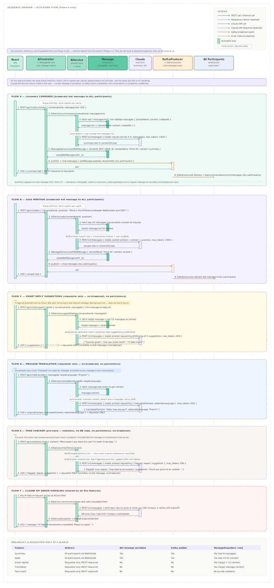

# AI Feature Flow

This document covers the complete flow for all five AI features in Orbit — `/summary`, `@ask`, smart reply suggestions, message translation, and tone checker. All five features are Phase 4 only and are entirely absent from the build in Phases 1 through 3.

---

## Diagram



---

## Architecture Overview

All five AI features share the same underlying infrastructure:

```
AiController → AiService → ClaudeApiClient → Anthropic API (claude-sonnet-4-6)
```

`AiService` is responsible for building prompts from conversation context and parsing Claude's response. `ClaudeApiClient` is the single point of contact with the Anthropic API — all five features route through it. Updating the API version, model name, timeout, or retry config requires a change in one place only.

### Broadcast vs Requester-Only

The most important architectural distinction across the five features is whether the result is broadcast to all participants or returned only to the requester.

| Feature       | Result delivery                  | Bot message persisted | Kafka publish |
|---------------|----------------------------------|-----------------------|---------------|
| `/summary`    | All participants via WebSocket   | Yes                   | Yes           |
| `@ask`        | All participants via WebSocket   | Yes                   | Yes           |
| Smart replies | Requester only via REST response | No                    | No            |
| Translation   | Requester only via REST response | No                    | No            |
| Tone checker  | Requester only via REST response | No                    | No            |

Summary and `@ask` produce results that are useful to everyone in the conversation — they are treated as bot messages, persisted to MongoDB, and fan-out delivered via the same Kafka → WebSocket path as regular messages. The other three features are personal and ephemeral — they are returned directly in the REST response, never persisted, and never visible to other participants.

### Bot User

Bot messages from `/summary` and `@ask` are inserted into the `messages` collection with a reserved `senderId` set to a system `BOT_USER_ID` and `senderName` set to `"Orbit AI"`. This user must be seeded into the `users` collection on application startup by a `DataInitializer` component — similar to the `MigrationService` that applies schema validators. The `DataInitializer` runs once on boot and is idempotent: if `BOT_USER_ID` already exists, it skips insertion. The bot user has no password, no email, and cannot authenticate — it exists solely as a message sender identity for bot-generated content.

---

## Shared Pre-conditions

Before any AI feature call reaches `AiController`, two checks apply:

**Rate limiting:** `RateLimitFilter` enforces 20 AI requests per minute per authenticated user across all five endpoints. Exceeding this returns a 429 with a `Retry-After` header.

**Phase gate:** `AiController` is simply absent from the build in Phases 1–3. It does not exist as a disabled endpoint — it does not exist at all. This ensures zero risk of accidental AI processing during early phases.

---

## Flow A — /summary Command

**Trigger:** User types `/summary` in a conversation and sends it. The React SPA detects the slash command and calls the summary endpoint instead of the regular message send endpoint.

**Purpose:** Generate a concise catch-up of recent conversation activity for users who have been offline or away.

**Step-by-step:**

1. `POST /api/v1/ai/summary { conversationId, messageLimit: 100 }` arrives at `AiController`
2. `AiService.summarise()` calls `MessageRepository` to fetch the last `messageLimit` non-deleted messages ordered by `createdAt` descending. Each message is represented as `{ senderName, content, createdAt }` — only the fields needed for summarisation
3. `AiService` constructs a system prompt instructing Claude to produce a concise summary, followed by a user prompt containing the formatted message list
4. `ClaudeApiClient` calls `POST https://api.anthropic.com/v1/messages` with `model: claude-sonnet-4-6` and `max_tokens: 1000`
5. The response text is extracted from `content[0].text`
6. `MessageService.insertBotMessage()` persists a new message document with `senderId: BOT_USER_ID`, `senderName: "Orbit AI"`, and `content: summaryText`
7. `KafkaProducerConfig` publishes the bot message to `chat.messages` with `recipientIds` set to all conversation participants
8. The REST response returns 200 with the summary text to the requester
9. `KafkaConsumerConfig` delivers the bot message to all participants' WebSocket sessions — everyone in the conversation sees the summary appear as a message from "Orbit AI"

**Context window note:** `messageLimit` defaults to 100 and is capped at 200. At an average of 50 tokens per message, 100 messages is approximately 5,000 tokens of context — well within `claude-sonnet-4-6`'s context window and leaving room for the system prompt and response.

---

## Flow B — @ask Assistant

**Trigger:** A group member sends a message containing `@ask` followed by a question. Unlike `/summary`, this does not replace the normal send action — the message is sent through the standard message send flow like any other group message, is persisted and delivered normally, and is what every group member sees as the question. Separately, the React SPA also detects the `@ask` mention and calls the ask endpoint to generate a response. See [`discussions/012_ask_mention_behavior.md`](../../discussions/012_ask_mention_behavior.md) for why `@ask` and `/summary` behave differently here.

**Purpose:** Collaborative AI Q&A inside a group — the answer is visible to everyone, making it a shared knowledge resource.

**Step-by-step:**

1. The user's message is sent and persisted through the normal group message flow (see `message_send_flow.md`) — this happens independently of the AI pipeline and is what the group sees as the question
2. `POST /api/v1/ai/ask { conversationId, question: "What is the difference between WebSockets and SSE?" }` arrives at `AiController`
3. `AiService.ask()` first confirms the target conversation is a group — a direct conversation is rejected here and no further processing happens (see [`discussions/012_ask_mention_behavior.md`](../../discussions/012_ask_mention_behavior.md))
4. `AiService.ask()` fetches the last 20 messages from `MessageRepository` to provide Claude with conversation context — this allows the answer to be aware of the ongoing discussion topic
5. `AiService` constructs a system prompt establishing Claude as a helpful assistant, a context section containing the recent messages, and a user section containing the question
6. `ClaudeApiClient` calls the Anthropic API and extracts the answer from `content[0].text`
7. `MessageService.insertBotMessage()` persists the answer as a bot message
8. `KafkaProducerConfig` publishes to `chat.messages` for all participants
9. The REST response returns 200 with the answer text to the requester
10. `KafkaConsumerConfig` delivers the bot message to all participants — the answer appears in the conversation thread for everyone, directly after the question

**Context design decision:** 20 messages of context is a deliberate balance. Too little context and Claude cannot tailor the answer to the conversation topic. Too much and the token cost grows with no proportional quality improvement for a Q&A task. The system prompt instructs Claude to use the context to inform relevance but to answer the question directly.

---

## Flow C — Smart Reply Suggestions

**Trigger:** Automatic — the React SPA calls this endpoint after receiving a new inbound message in a conversation. It is a background call that does not block the UI.

**Purpose:** Offer the user 2–3 contextual one-tap reply options below the message input, reducing friction for quick responses.

**Step-by-step:**

1. `POST /api/v1/ai/suggest-replies { conversationId, messageId }` arrives at `AiController`
2. `AiService.suggestReplies()` fetches the target message and the last 10 messages for context from `MessageRepository`
3. `AiService` constructs a prompt instructing Claude to generate exactly 3 short, natural reply suggestions as a JSON array. The system prompt requests that suggestions be distinct in tone — one neutral, one enthusiastic, one clarifying — so the user has genuine choice
4. `ClaudeApiClient` calls the Anthropic API. The response is parsed as a JSON array of strings
5. `AiController` returns `200 { suggestions: ["…", "…", "…"] }` to the requester only

**No persistence, no broadcast.** Suggestions are ephemeral — displayed below the message input in the React SPA and discarded once the user replies or dismisses them. Other participants never see them.

**Prompt format for reliable JSON:** The system prompt instructs Claude to respond only with a valid JSON array and nothing else — no preamble, no markdown fences. `AiService` wraps the parse in a try-catch; if parsing fails, it falls back to a set of generic suggestions rather than returning an error.

---

## Flow D — Message Translation

**Trigger:** On-demand — user clicks "Translate" on a specific message. Available on any message in any conversation.

**Purpose:** Enable multilingual groups where participants may write in different languages, without requiring everyone to use the same language.

**Step-by-step:**

1. `POST /api/v1/ai/translate { messageId, targetLanguage: "English" }` arrives at `AiController`
2. `AiService.translate()` fetches the message document from `MessageRepository` to get its content
3. `AiService` constructs a prompt asking Claude to translate the content to the target language and identify the source language. The response format requested is JSON: `{ translatedContent, detectedLanguage }`
4. `ClaudeApiClient` calls the Anthropic API
5. `AiController` returns `200 { originalContent, translatedContent, detectedLanguage }` to the requester only

**No persistence, no broadcast.** The translation is shown inline below the original message text in the requester's UI only. Other participants see the original. The translated text is not stored — if the user navigates away and returns, they can click Translate again.

**Idempotency:** Translating the same message twice produces the same result. The `messageId` is stable, the content does not change, and Claude's translation is deterministic enough for practical purposes. No caching is implemented in Phase 4 — this can be added if API cost becomes a concern.

---

## Flow E — Tone Checker

**Trigger:** Pre-send — the user has typed a message and has the tone check toggle enabled in their settings. Fires when the user presses send, before the message is transmitted to the server.

**Purpose:** Flag messages that may read as aggressive, unclear, or likely to be misread, and offer a softer alternative before the message reaches the recipient.

**Step-by-step:**

1. `POST /api/v1/ai/tone-check { content: "Why haven't you done this yet? It's been three days." }` arrives at `AiController`
2. `AiService.checkTone()` builds a prompt directly from the input text — no `MessageRepository` call, no conversation context. Tone checking is purely stateless on the typed text
3. `AiService` constructs a prompt asking Claude to analyse the tone and return `{ flagged: Boolean, reason: String, suggestion: String }` as JSON
4. `ClaudeApiClient` calls the Anthropic API
5. `AiController` returns `200 { flagged, reason, suggestion }` to the requester

**React SPA behaviour:** If `flagged: true`, the SPA shows the suggestion inline above the send button with options to send the original, apply the suggestion, or dismiss. If `flagged: false`, no UI change occurs and the message is sent normally.

**No persistence, no broadcast.** The tone check happens entirely before a message exists. If the user proceeds to send, that send goes through the standard message send flow documented in `message_send_flow.md`.

Because tone checking is purely stateless and makes no database calls, it is the fastest and cheapest of the five AI features. Consider adding client-side debouncing in the React SPA to avoid firing it on every keystroke — a 500ms debounce after the user stops typing is sufficient.

---

## Flow F — Shared Error Handling

Claude API failures are handled consistently across all five features. `AiService` wraps every `ClaudeApiClient` call in a try-catch. On any exception — 5xx from Anthropic, timeout, rate limit from Anthropic, overloaded response — `AiService` throws an `AiServiceException` which `GlobalExceptionHandler` converts to a `503` response:

```json
{
  "status": 503,
  "error": "Service Unavailable",
  "message": "AI feature temporarily unavailable. Please try again.",
  "path": "/api/v1/ai/summary",
  "timestamp": "2026-06-27T10:30:00Z"
}
```

**Critical principle:** On failure, no bot message is persisted and no Kafka event is published. The conversation is completely unaffected. All five AI features are best-effort enhancements — their failure must never degrade the core messaging experience.

`ClaudeApiClient` applies a 30-second timeout and two retries with exponential backoff before surfacing the exception to `AiService`. This means Anthropic API transient errors are handled transparently in most cases.

---

## Prompt Design Principles

All five prompts follow the same structure to keep `AiService` consistent and maintainable:

**System message:** Establishes Claude's role, output format requirements, and constraints. For features requiring JSON output, the system message explicitly states "respond only with valid JSON and nothing else — no preamble, no markdown, no explanation."

**User message:** Provides the actual input — conversation context, question, message content, or text to analyse.

**Model:** `claude-sonnet-4-6` across all features. Fast enough for interactive use, capable enough for all five tasks.

**max_tokens:** Varies by feature — 1000 for summary and @ask, 200 for smart replies (three short strings), 500 for translation, 300 for tone check. Setting appropriate limits controls cost and latency.

---

## Implementation Reference

| Component                           | Role                                                                                               |
|-------------------------------------|----------------------------------------------------------------------------------------------------|
| `AiController`                      | Routes the five REST endpoints, applies rate limiting via `RateLimitFilter`                        |
| `AiService`                         | Builds prompts, calls `ClaudeApiClient`, parses responses, calls `MessageService` for bot messages |
| `ClaudeApiClient`                   | Single wrapper for all Anthropic API calls — model, timeout, retry config in one place             |
| `MessageService.insertBotMessage()` | Persists bot messages and triggers Kafka fan-out for broadcast features                            |
| `MessageRepository`                 | Read-only access for context fetching in summary, @ask, smart replies, and translation             |
| `GlobalExceptionHandler`            | Converts `AiServiceException` to consistent 503 error envelope                                     |

---

## What This Document Does Not Cover

The WebSocket delivery of bot messages after Kafka publish follows the identical fan-out path documented in `message_send_flow.md` Flow D. The bot message is indistinguishable from a regular message at the Kafka and WebSocket layer — `KafkaConsumerConfig` handles it the same way regardless of whether the `senderId` is a human user or `BOT_USER_ID`.
