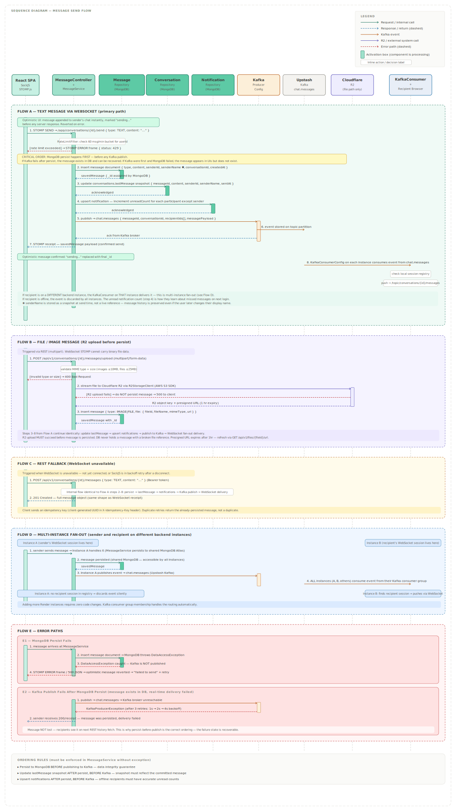

# Message Send Flow

This document covers the complete flow of sending a message in Orbit — from the moment the user presses send to the moment recipients receive it on their screen. It covers the primary WebSocket path, the file message variant, the REST fallback, multi-instance fan-out, optimistic UI, and all error paths.

---

## Diagram



---

## Overview

Every message send in Orbit follows the same internal sequence regardless of whether it arrives via WebSocket or REST:

```
Persist to MongoDB → Update lastMessage snapshot → Upsert notifications → Publish to Kafka → Fan-out to WebSocket sessions
```

The most important rule in the entire backend is the ordering of the first and fourth steps: **MongoDB persist always happens before Kafka publish, never after.** This ordering is explained in detail in the Error Paths section below.

---

## Flow A — Text Message via WebSocket (Primary Path)

This is the normal path for all text messages sent while the WebSocket connection is active.

### Optimistic UI

Before any network call is made, the React SPA appends the message to the conversation immediately, marked with a "sending…" indicator. This is the optimistic UI pattern — the user sees their message appear instantly without waiting for server confirmation. If the server returns an error, the optimistic message is reverted and a "failed to send" state is shown with a retry option.

### Step-by-Step

**1. STOMP SEND frame**  
The React SPA sends a STOMP SEND frame to `/app/conversations/{conversationId}/send` with the message payload. This is routed by the STOMP broker to `MessageController`, which delegates to `MessageService`. Immediately on arrival, `RateLimitFilter` checks the sender's token bucket — 60 messages per minute per user. If exceeded, a STOMP ERROR frame with status 429 is returned immediately and nothing below is reached.

**2. Persist to MongoDB** ← critical step  
`MessageService` inserts the message document via `MessageRepository`. The document includes `conversationId`, `senderId`, `senderName` (snapshot), `type`, `content`, `deleted: false`, `edited: false`, and `createdAt`. MongoDB assigns the `_id`. This step happens before any Kafka publish — see the Error Paths section for the reason.

**3. Update lastMessage snapshot**  
`ConversationRepository` updates the `lastMessage` embedded document on the conversation with a content snapshot, `senderId`, `senderName`, and `sentAt`. This denormalised field powers the conversation list display without requiring a message query.

**4. Upsert unread notification**  
`NotificationRepository` increments the `unreadCount` for every participant in the conversation except the sender, using an upsert on `{ userId, conversationId }`. This ensures offline recipients have an accurate unread count when they reconnect.

**5. Publish to Kafka**  
`KafkaProducerConfig` publishes an event to the `chat.messages` topic containing the `messageId`, `conversationId`, `recipientIds[]`, and the full message payload.

**6. Kafka broker acknowledges receipt**  
The event is stored on the topic partition and the Upstash broker returns an ack to `KafkaProducerConfig`.

**7. Return receipt to sender**  
`MessageService` returns the saved message object (with its assigned `_id`) to the sender via a STOMP receipt frame. The React SPA uses this to replace the optimistic message's temporary state with the final confirmed message.

**8. Kafka consumer delivers to recipients**  
`KafkaConsumerConfig` on every running backend instance consumes the event. Each instance checks its local WebSocket session registry. The instance holding a session for a recipient delivers the message via STOMP to `/topic/conversations/{conversationId}/messages`. Instances with no relevant sessions discard the event silently.

**Phase note:** Steps 1–8 above are the complete Phase 1 flow. There is no Kafka publish for notifications in Phase 1 — `unreadCount` is written directly to MongoDB and read back via `GET /api/v1/conversations` on load or reconnect. Real-time push of unread-count changes to an already-open client (via `chat.notifications` → `/user/queue/notifications`) is a Phase 2 addition — see `TECH_STACK.md` Kafka Topics and `FEATURES.md` Phase 2 Notifications.

### What Happens if the Recipient is Offline

If no instance holds a WebSocket session for a recipient, the event is consumed and discarded by all instances. The recipient is not lost — they will see the message on their next conversation history fetch, and their unread count (incremented in step 5) will indicate the missed message.

---

## Flow B — File and Image Message

File and image messages follow a different entry path — they use the REST endpoint `POST /api/v1/conversations/{conversationId}/messages/upload` rather than the STOMP SEND destination, because multipart file data cannot be sent over STOMP frames.

**1. File validation**
`MessageService` validates the MIME type and size before doing anything else. Images must be `image/jpeg`, `image/png`, `image/webp`, or `image/gif` and under 10MB. Other file types are accepted up to 25MB. Validation failure returns a 400 immediately — nothing is uploaded.

**2. Upload to Cloudflare R2**
`R2StorageClient` streams the file to Cloudflare R2 via the AWS S3 SDK. If the R2 upload fails, `MessageService` returns a 500 to the client and does not create a message document. This ensures the database never contains a message with a broken file reference.

**3. Persist message with file metadata**
On successful R2 upload, `MessageService` inserts the message document with `type: IMAGE` or `FILE` and an embedded `file` subdocument containing `fileId` (R2 object key), `fileName`, `mimeType`, and the presigned URL (1-hour expiry).

**4. Remainder of flow**
Steps 3 through 8 from Flow A continue identically — update lastMessage, upsert notifications, publish to Kafka, fan-out delivery.

### Presigned URL Expiry

The presigned R2 URL stored on the message expires after one hour. When a client renders a file message and the URL has expired, it calls `GET /api/v1/files/{fileId}/url` to get a fresh presigned URL. The `fileId` (R2 object key) is the durable reference — the URL is ephemeral.

---

## Flow C — REST Fallback

When the WebSocket connection is not available — either not yet established on initial load, or dropped during a SockJS backoff retry — the React SPA falls back to the REST endpoint `POST /api/v1/conversations/{conversationId}/messages`.

The internal processing in `MessageService` is identical to Flow A from step 2 onward — persist, lastMessage update, notification upsert, Kafka publish, WebSocket fan-out. The only difference is the entry point: HTTP request/response instead of STOMP frame.

The REST endpoint returns a 201 with the full message object. The React SPA uses an idempotency key (a client-generated UUID sent in the request) so that duplicate submissions caused by retry logic return the already-persisted message rather than creating a duplicate.

---

## Flow D — Multi-Instance Fan-Out

When multiple instances of the Spring Boot monolith are running behind Render, the sender and a recipient may have their WebSocket sessions on different instances.

**Why this works without coordination:**

All instances connect to the same shared MongoDB Atlas cluster, so any instance can persist and read any message. All instances connect to the same Upstash Kafka cluster, so a Kafka publish by Instance A is immediately available for consumption by Instance B. Each instance's `KafkaConsumerConfig` independently checks its own local session registry after consuming an event. The instance holding the recipient's session delivers — others discard.

This means adding a second or third Render instance requires no code changes and no additional configuration. The Kafka consumer group configuration already handles it — each instance is a member of the same consumer group, and Kafka delivers each event to one instance per group member.

---

## Flow E — Error Paths

### E1 — MongoDB Persist Fails

If `MessageRepository.insert()` throws a `DataAccessException` (MongoDB unavailable, network error, Atlas downtime), `GlobalExceptionHandler` catches it and returns a STOMP ERROR frame (or 500 on the REST path). **Kafka is never published.** The optimistic message in the sender's UI is reverted to a failed state with a retry option.

No message is created anywhere — the failure is clean.

### E2 — Kafka Publish Fails After MongoDB Persist

This is the more complex failure case. The message has been persisted to MongoDB (step 2 succeeded) but `KafkaProducerConfig` cannot reach the Upstash broker (step 5 fails).

Spring Kafka applies automatic retries before surfacing the exception — the default production configuration is three retries with 1s/2s/4s exponential backoff. If all retries fail, a `KafkaProducerException` is thrown.

The sender receives a 200/receipt because the message was persisted. **The message is not lost.** Recipients will see it on their next REST history fetch. Real-time delivery failed for this specific message, but the data integrity is preserved.

This is precisely why persist-before-publish is the correct ordering. If the sequence were reversed — publish to Kafka first, then persist — and the persist step failed, the message would appear in recipient UIs but not exist in the database. That state (message visible but not stored) is far worse than the E2 case (message stored but not immediately delivered in real-time).

E2 is not a catastrophic failure and should not be over-engineered around. The message exists in MongoDB, the unread count is correct, and the user sees it on next load. Real-time delivery is best-effort — durability is not. The Spring Kafka retry configuration belongs in `application.yml`: `spring.kafka.producer.retries=3` with a custom `RetryTopicConfiguration` bean for the 1s/2s/4s backoff schedule.

---

## Ordering Rules — Summary

These rules must be followed in `MessageService` without exception:

| Rule | Reason |
|---|---|
| Persist to MongoDB before publishing to Kafka | Data integrity — see E2 above |
| Update lastMessage after persist, before Kafka | Snapshot must reflect the committed message |
| Upsert notifications after persist, before Kafka | Unread count must be correct for offline users |
| R2 upload before any document creation (file messages) | No message document with a broken file reference |
| Never publish to Kafka if MongoDB throws | No phantom messages in recipient UIs |

---

## Implementation Reference

| Component | Role in this flow |
|---|---|
| `MessageController` | Routes STOMP SEND frames and REST POSTs to `MessageService` |
| `MessageService` | Owns the entire send flow — all ordering rules enforced here |
| `MessageRepository` | Persists the message document |
| `ConversationRepository` | Updates the `lastMessage` denormalised snapshot |
| `NotificationRepository` | Upserts unread counts per participant |
| `KafkaProducerConfig` | Publishes the fan-out event to `chat.messages` topic |
| `KafkaConsumerConfig` | Consumes from `chat.messages` and delivers to local WebSocket sessions |
| `R2StorageClient` | Handles file upload for file and image message types |
| `GlobalExceptionHandler` | Converts exceptions to consistent error responses |

---

## What This Document Does Not Cover

Typing indicators and presence events follow a simpler path — they are published directly to `chat.presence` without persistence and are documented as part of the WebSocket lifecycle in `websocket_lifecycle.md`. The AI feature message flow — where a bot message is generated and broadcast — is covered in `ai_feature_flow.md`.
