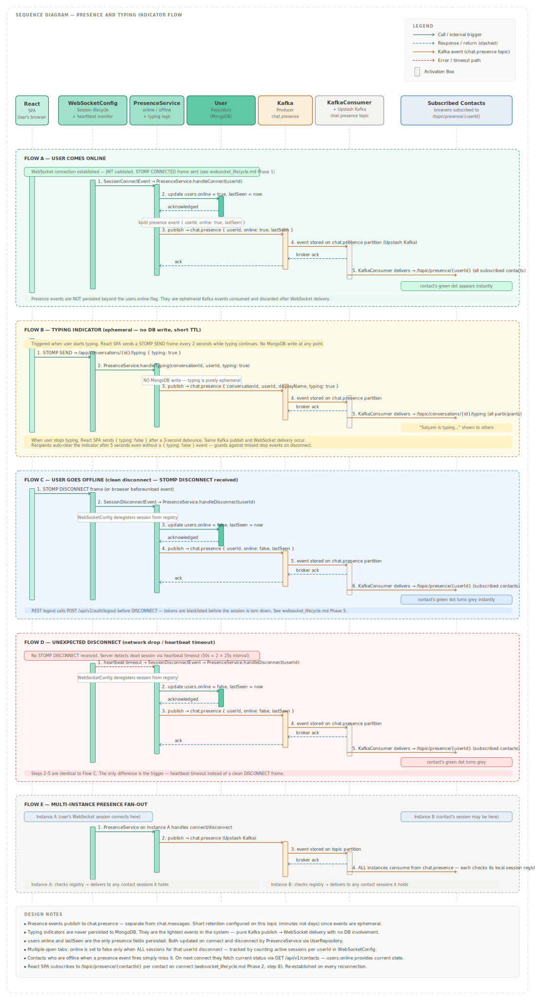

# Presence and Typing Indicator Flow

This document covers the complete flow for online/offline presence and typing indicators in Orbit. These are the two real-time features that operate entirely outside the message send flow — they use the `chat.presence` Kafka topic rather than `chat.messages`, and typing indicators involve zero database writes.

---

## Diagram

---

## Overview

Presence and typing indicators share the same Kafka topic (`chat.presence`) and the same WebSocket fan-out mechanism as message delivery, but they are architecturally lighter in every other way.

| Feature | MongoDB write | Kafka topic | WebSocket destination |
|---|---|---|---|
| User comes online | `users.online = true` | `chat.presence` | `/topic/presence/{userId}` |
| User goes offline | `users.online = false` | `chat.presence` | `/topic/presence/{userId}` |
| Typing indicator | None | `chat.presence` | `/topic/conversations/{id}/typing` |

The `chat.presence` topic is configured with a short retention period — minutes rather than days — because presence events are ephemeral. An offline event from yesterday has no value today.  
When creating the `chat.presence` topic in Upstash, set retention explicitly to 10 minutes. The default 7-day retention makes no sense for ephemeral events and wastes storage quota on the free tier.
---

## Components Involved

| Component | Role |
|---|---|
| `WebSocketConfig` | Fires `SessionConnectEvent` and `SessionDisconnectEvent` on session lifecycle changes. Maintains the per-userId session count for multi-tab handling. |
| `PresenceService` | Handles all presence logic — DB update, Kafka publish, typing indicator publish. Single point of ownership for all presence state changes. |
| `UserRepository` | Persists `online` flag and `lastSeen` timestamp on connect and disconnect. |
| `KafkaProducerConfig` | Publishes presence events to `chat.presence` topic. |
| `KafkaConsumerConfig` | Consumes from `chat.presence` and delivers to WebSocket sessions held by the current instance. |

---

## Flow A — User Comes Online

Triggered immediately after the WebSocket handshake completes. The full connection sequence is documented in `websocket_lifecycle.md` Phase 1 — presence handling begins after the STOMP `CONNECTED` frame is sent.

**Step-by-step:**

1. `WebSocketConfig` fires a `SessionConnectEvent` to `PresenceService.handleConnect(userId)`
2. `PresenceService` calls `UserRepository` to set `users.online = true` and `lastSeen = now`
3. `PresenceService` builds a presence event `{ userId, online: true, lastSeen }` and calls `KafkaProducerConfig`
4. `KafkaProducerConfig` publishes the event to the `chat.presence` topic on Upstash Kafka and receives a broker ack
5. `KafkaConsumerConfig` on all running instances consumes the event and delivers it to any contact sessions subscribed to `/topic/presence/{userId}`
6. Subscribed contacts' UIs update — the green dot appears next to the user's name instantly

**What contacts must do to receive presence updates:** Each contact's React SPA must be subscribed to `/topic/presence/{userId}` for this user. This subscription is established immediately after STOMP `CONNECTED` as part of Phase 2 of the WebSocket lifecycle — one subscription per contact in the user's contact list.

---

## Flow B — Typing Indicator

Triggered client-side when the user starts typing in a conversation input field. This is the lightest event in the entire system — no MongoDB write occurs at any point.

**Step-by-step:**

1. React SPA sends a STOMP SEND frame to `/app/conversations/{id}/typing` with `{ typing: true }` every 2 seconds while typing continues
2. `WebSocketConfig` routes the frame to `PresenceService.handleTyping(conversationId, userId, typing: true)`
3. `PresenceService` skips any DB call and immediately builds a typing event `{ conversationId, userId, displayName, typing: true }`
4. `KafkaProducerConfig` publishes to `chat.presence` and receives a broker ack
5. `KafkaConsumerConfig` delivers to all participants subscribed to `/topic/conversations/{id}/typing`
6. Other participants' UIs show "Satyam is typing…" instantly

**Stopping the indicator:** When the user stops typing, React SPA sends `{ typing: false }` after a 3-second debounce. The same Kafka publish and WebSocket delivery path runs, and the indicator clears for all participants.

**Self-clearing safety net:** Recipients auto-clear the typing indicator after 5 seconds even if no `{ typing: false }` event arrives. This guards against the case where the typing user disconnects mid-sentence — without this, the indicator would remain indefinitely.

**Why 2-second interval for typing: true events:** The interval is a balance between responsiveness and Kafka throughput. Sending on every keystroke would produce hundreds of events per minute per active user. Two seconds means at most 30 events per minute per user — manageable at scale while still feeling real-time.

**Blocked-sender suppression:** If the typing user is blocked by the other participant in a 1:1 conversation, `PresenceService.handleTyping()` skips the Kafka publish in step 4 entirely — the typing event never reaches the blocked-by participant, consistent with all other one-directional signals suppressed by a block (presence, profile visibility). This does not apply to group typing indicators. See `docs/discussions/007_blocking_behavior.md`.

---

## Flow C — Clean Disconnect (Logout or Tab Close)

Triggered by the user logging out or closing the browser tab. The full logout sequence including token blacklisting is in `websocket_lifecycle.md` Phase 5 — presence handling occurs as part of that teardown.

**Step-by-step:**

1. React SPA sends a STOMP `DISCONNECT` frame (via `beforeunload` on tab close)
2. `WebSocketConfig` fires a `SessionDisconnectEvent` to `PresenceService.handleDisconnect(userId)` and deregisters the session from the session registry
3. `PresenceService` calls `UserRepository` to set `users.online = false` and `lastSeen = now`
4. `PresenceService` builds a presence event `{ userId, online: false, lastSeen }` and calls `KafkaProducerConfig`
5. `KafkaProducerConfig` publishes to `chat.presence` and receives a broker ack
6. `KafkaConsumerConfig` delivers to subscribed contacts via `/topic/presence/{userId}`
7. Subscribed contacts' UIs update — the green dot turns grey and `lastSeen` is available for display

---

## Flow D — Unexpected Disconnect (Network Drop / Heartbeat Timeout)

Triggered when the server detects a dead WebSocket session through heartbeat failure rather than a clean `DISCONNECT` frame. The browser does not always fire `beforeunload` reliably — this flow is the safety net.

**Trigger:** No STOMP heartbeat response received within 50 seconds (2 × the 25-second heartbeat interval). `WebSocketConfig` closes the session and fires `SessionDisconnectEvent`.

**Steps 2 through 6 are identical to Flow C.** The only difference is the trigger — heartbeat timeout instead of a clean DISCONNECT frame. The end result for contacts is exactly the same: the green dot turns grey and `lastSeen` is updated.

This means clean and unexpected disconnections are indistinguishable from the contact's perspective — both result in immediate presence update.

---

## Flow E — Multi-Instance Presence Fan-Out

Presence events follow the same Kafka fan-out pattern as message delivery. When `PresenceService` on Instance A publishes a presence event to `chat.presence`, all running backend instances consume it from their Kafka consumer group. Each instance checks its local session registry and delivers to any contact sessions it holds.

This means adding more Render instances requires no code changes to presence handling — the Kafka consumer group membership handles routing automatically, identical to the message fan-out documented in `message_send_flow.md` Flow D.

---

## Multi-Tab Handling

A user with multiple open browser tabs has multiple WebSocket sessions simultaneously — one per tab. `WebSocketConfig` maintains a count of active sessions per `userId` in the session registry.

- `users.online` is set to `true` when the **first** session for a userId connects
- `users.online` is set to `false` only when the **last** session for a userId disconnects
- An online presence event is NOT broadcast on every new tab open — only on the first connection
- An offline presence event is NOT broadcast when a tab closes if other tabs remain open

This prevents contacts from seeing a user flicker between online and offline when opening or closing individual tabs.

---

## What Contacts See vs What is Stored

| Contact sees | What drives it |
|---|---|
| Green dot | `users.online: true` + live `/topic/presence/{userId}` event |
| Grey dot | `users.online: false` + live `/topic/presence/{userId}` event |
| "Last seen 10 mins ago" | `users.lastSeen` field on the user document |
| "Satyam is typing…" | Live `/topic/conversations/{id}/typing` event — no DB field |
| Typing indicator disappears | `{ typing: false }` event or 5-second auto-clear |
| Nothing (if blocked by the contact) | `PresenceService` suppresses both presence and typing events one-directionally toward a user who has been blocked — see `discussions/007_blocking_behavior.md`. Suppression applies even inside a shared group's member list for presence specifically; typing suppression is 1:1-only. |

Contacts who are offline when a presence event fires miss it entirely. When they reconnect, their React SPA calls `GET /api/v1/contacts` which returns each contact's current `online` status and `lastSeen` from the `users` collection — providing an accurate snapshot without needing replayed events.

---

## Implementation Reference

| Component | Key methods |
|---|---|
| `PresenceService` | `handleConnect(userId)`, `handleDisconnect(userId)`, `handleTyping(conversationId, userId, typing)` |
| `WebSocketConfig` | `@EventListener(SessionConnectEvent.class)`, `@EventListener(SessionDisconnectEvent.class)` — wired to `PresenceService` |
| `KafkaProducerConfig` | Publishes to `chat.presence` topic — same producer bean used for `chat.messages` |
| `KafkaConsumerConfig` | Separate consumer method for `chat.presence` events — routes to `/topic/presence/{userId}` or `/topic/conversations/{id}/typing` depending on event type |
| `UserRepository` | `updateOnlineStatus(userId, online, lastSeen)` — called only on connect/disconnect, never on typing |
