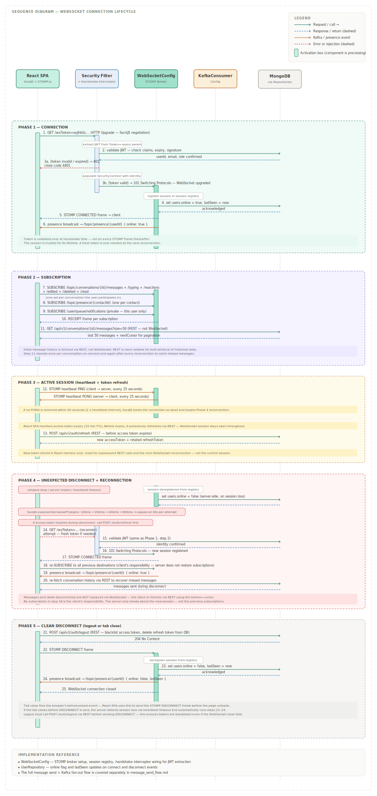

# WebSocket Connection Lifecycle

This document describes the complete lifecycle of a WebSocket connection in Orbit — from initial connection through active session management, unexpected disconnection and reconnection, and clean logout. This sequence is the foundation that all real-time features depend on.

---

## Diagram



---

## Overview

Orbit uses WebSockets via the STOMP protocol over SockJS. SockJS provides automatic fallback to HTTP long-polling if WebSocket is unavailable in the client's network environment, though WebSocket is used in all normal cases. The backend STOMP broker is configured in `WebSocketConfig`, and session lifecycle events are handled there and in the presence logic.

The lifecycle has five distinct phases:

| Phase | Trigger | Key outcome |
|---|---|---|
| Connection | User logs in or app loads | Session registered, user marked online |
| Subscription | Immediately after CONNECTED | Client subscribed to all relevant topics |
| Active session | Ongoing | Heartbeat maintained, token refreshed via REST |
| Reconnection | Network drop or server restart | New session, re-subscription, missed messages recovered via REST |
| Clean disconnect | Logout or tab close | Session deregistered, user marked offline, presence broadcast |

---

## Phase 1 — Connection

The connection handshake is initiated by SockJS on the React SPA. The JWT access token is passed as a query parameter on the initial HTTP upgrade request:

```
GET wss://api.orbit.onrender.com/ws?token=eyJhbGc...
```

**Why query parameter and not a header?** The WebSocket API in browsers does not support custom headers on the initial upgrade request. The query parameter approach is the standard workaround for WebSocket JWT authentication.

**Server-side steps:**
1. The Spring Security handshake interceptor extracts the token from the `?token=` query parameter
2. JWT claims and expiry are validated — on failure the connection is refused with close code `4401`
3. On success, the `SecurityContext` is populated with the user's identity
4. The STOMP session is registered in the `WebSocketConfig` session registry
5. `users.online` is set to `true` and `lastSeen` is updated in MongoDB
6. A STOMP `CONNECTED` frame is sent back to the client
7. A presence event is broadcast to `/topic/presence/{userId}` with `online: true` — all contacts subscribed to this topic receive it immediately

**Important:** The JWT is validated only at connection time. Individual STOMP frames received after connection are not re-validated — the session is trusted for its lifetime. If the access token expires mid-session, the WebSocket connection remains open. The client only needs a fresh token at the next reconnection.

---

## Phase 2 — Subscription

Immediately after receiving the STOMP `CONNECTED` frame, the React SPA sends `SUBSCRIBE` frames for every topic it needs to receive events on.

**Subscriptions sent on connect:**

| Destination | Purpose |
|---|---|
| `/topic/conversations/{id}/messages` | New messages in a conversation — one per conversation |
| `/topic/conversations/{id}/typing` | Typing indicators — one per conversation |
| `/topic/conversations/{id}/reactions` | Reaction updates — one per conversation |
| `/topic/conversations/{id}/messages/edited` | Edit events — one per conversation |
| `/topic/conversations/{id}/messages/deleted` | Delete events — one per conversation |
| `/topic/conversations/{id}/read` | Read receipts — one per conversation |
| `/topic/presence/{contactId}` | Online/offline for a contact — one per contact |
| `/user/queue/notifications` | Private unread counts and mention alerts |

After subscribing, the client fetches the initial message history for each conversation via REST (`GET /api/v1/conversations/{id}/messages`) rather than WebSocket. This separation is intentional — REST is more reliable for bulk historical data retrieval than WebSocket.

---

## Phase 3 — Active Session

### Heartbeat

STOMP heartbeats keep the connection alive and allow both sides to detect a dead connection without waiting for a network timeout. Orbit uses a 25-second interval in both directions — client sends a heartbeat every 25 seconds, server responds with one.

If no response is received within 2× the heartbeat interval (50 seconds), SockJS considers the connection dead and begins reconnection automatically.

### Access Token Expiry

The JWT access token has a 15-minute expiry. The React SPA monitors this expiry client-side and proactively calls `POST /api/v1/auth/refresh` via REST before the token expires. This uses refresh token rotation — a new refresh token is issued and the old one is immediately invalidated, per `API_CONTRACTS.md`.

The WebSocket session is unaffected by this refresh — it remains open throughout. The new access token is stored in memory and used for subsequent REST calls and the next WebSocket reconnection.

---

## Phase 4 — Unexpected Disconnect and Reconnection

An unexpected disconnect can happen for several reasons — network interruption, device sleep, server restart, or Render's free tier spinning the instance down. SockJS detects this via heartbeat timeout or a hard close event.

### SockJS Reconnection Schedule

SockJS uses an exponential backoff strategy for reconnection attempts:

| Attempt | Wait before retry |
|---|---|
| 1 | 100ms |
| 2 | 200ms |
| 3 | 400ms |
| 4 | 800ms |
| 5+ | Capped at 30 seconds |

After 5 failed attempts, the React SPA should display a visible reconnecting indicator to the user.

### Reconnection Steps

1. If the access token has expired during the disconnect, the SPA calls `POST /api/v1/auth/refresh` via REST before attempting to reconnect
2. A new WebSocket upgrade request is sent with the fresh token
3. JWT validation runs again — same as Phase 1
4. A new session is registered in the session registry
5. The client re-subscribes to all previous destinations — this is the client's responsibility, not the server's
6. A fresh presence event broadcasts `online: true` to all contacts

### Missed Messages

Messages sent to a conversation while the client was disconnected are not replayed via WebSocket. Once reconnected, the React SPA calls `GET /api/v1/conversations/{id}/messages` with a `before` cursor to fetch any messages newer than the last received. Unread counts in the notification documents ensure the client knows which conversations have missed messages.

---

## Phase 5 — Clean Disconnect

A clean disconnect is triggered by user logout or by the browser tab closing.

### Logout Flow

1. React SPA calls `POST /api/v1/auth/logout` via REST — blacklists the access token and deletes the refresh token from MongoDB
2. React SPA sends a STOMP `DISCONNECT` frame to the server
3. `WebSocketConfig` deregisters the session from the session registry
4. `users.online` is set to `false` and `lastSeen` is updated in MongoDB
5. A presence event is broadcast to `/topic/presence/{userId}` with `online: false` and the `lastSeen` timestamp — all subscribed contacts receive it
6. The WebSocket connection is closed

### Tab Close

The browser fires a `beforeunload` event when the tab is closed, which the React SPA uses to send the STOMP `DISCONNECT` frame before the page unloads. This is a best-effort mechanism — if the browser kills the tab before the frame is sent, the server detects the dead session via heartbeat timeout and runs steps 3–5 automatically.

---

## Multi-Instance Behaviour

When the backend is scaled horizontally, a user's WebSocket session is held by one specific instance — whichever instance accepted the initial connection. The session registry in `WebSocketConfig` is local to that instance.

Presence events and other fan-out messages published to Kafka by any instance are consumed by all instances. The instance holding the relevant WebSocket session delivers the message; others discard it silently. This is the mechanism documented in `discussions/002_websocket_scaling.md`.

On reconnection after a server restart, the client may connect to a different instance. The re-subscription in Phase 4 re-establishes the session on whichever instance accepts the new connection — no server-side coordination is needed.

---

## Implementation Reference

| Component | Responsibility in this lifecycle |
|---|---|
| `WebSocketConfig` | STOMP broker setup, session registry, handshake interceptor wiring |
| `Spring Security Filter Chain` | JWT validation on the handshake upgrade request |
| `KafkaConsumerConfig` | Consumes presence events and delivers to subscribed sessions |
| `UserRepository` | `online` flag and `lastSeen` updates on connect/disconnect |
| `AuthService` | Token refresh, logout blacklisting |
| React SPA (SockJS + STOMP.js) | Connection initiation, subscription management, reconnection, heartbeat |

---

## What This Document Does Not Cover

The mechanics of sending a message and routing it through Kafka to WebSocket subscribers is a separate flow — see `message_send_flow.md`. The AI feature interaction flow, which also uses WebSocket for bot message delivery, is covered in `ai_feature_flow.md`.
