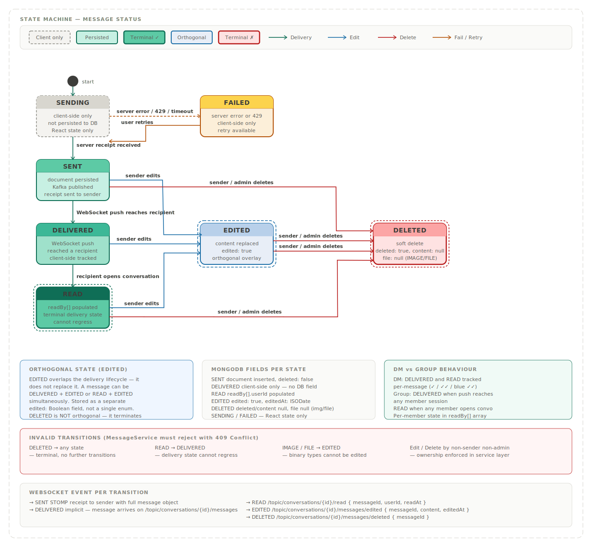

# Message Status State Machine

This document defines every state a message can occupy in Orbit, every valid transition between states, what triggers each transition, and how state is represented in the MongoDB document. This is the reference for implementing status tracking in `MessageService`, the React SPA, and the WebSocket delivery layer.

---

## Diagram



---

## States

### SENDING
**Persisted:** No — client-side React state only

The optimistic UI state. Exists only in the React SPA between the moment the user presses send and the moment the server receipt arrives. The message document does not exist in MongoDB while a message is in this state. Shown to the sender as a "sending…" indicator, typically a single grey clock icon.

If the server never responds (timeout, network drop), the message transitions to `FAILED`. It never silently disappears.

---

### SENT
**Persisted:** Yes  
**MongoDB fields:** `deleted: false`, `edited: false`, document `_id` assigned

The first persisted state. A message enters `SENT` when:
- `MessageRepository` has successfully inserted the document
- Kafka has published the fan-out event
- The STOMP receipt or REST 201 has been returned to the sender

From the sender's perspective, shown as a single green tick (✓). The message exists in the database. Recipients may not have received it yet.

---

### DELIVERED
**Persisted:** Tracked client-side — no explicit `delivered` field in MongoDB

A message is considered `DELIVERED` when `KafkaConsumerConfig` on any backend instance successfully pushes the STOMP frame to at least one recipient's active WebSocket session. This transition is acknowledged client-side by the sender's React SPA via the `/topic/conversations/{id}/messages` subscription — when the sender's SPA sees the message appear on the topic, it knows delivery occurred.

There is no explicit `delivered: true` field stored on the MongoDB document. The `readBy[]` array is the only server-side delivery record. This is a deliberate design decision — tracking delivery state server-side would require a write per recipient per message, which is expensive at scale. Client-side delivery acknowledgment is sufficient for a chat application.

Shown to the sender as a double grey tick (✓✓).

**Note for group messages:** `DELIVERED` is set when the WebSocket push reaches any member's session — not all members. Members who are offline at the time of delivery are covered by their unread notification counts on reconnect.

---

### READ
**Persisted:** Yes — via `readBy[]` array
**MongoDB fields:** `readBy: [ { userId, readAt } ]` populated for the reading user
**Terminal:** Yes — for the delivery lifecycle

A message transitions to `READ` when a participant opens the conversation and `POST /api/v1/conversations/{conversationId}/messages/{messageId}/read` is called. This adds the user's `userId` and `readAt` timestamp to the `readBy[]` embedded array via `$addToSet` equivalent.

Shown to the sender as double blue ticks (✓✓) — the Signal and WhatsApp convention.

`READ` is the terminal state of the delivery lifecycle. A message cannot transition back to `DELIVERED` once any recipient has read it.

**Note for group messages:** `READ` at the message level is set when any member reads it. The full per-member read state is in `readBy[]` — the frontend can show "Read by 3 of 12 members" by inspecting the array length. The message-level status transitions the same way regardless of group size.

---

### EDITED
**Persisted:** Yes
**MongoDB fields:** `edited: true`, `editedAt: ISODate`, `content` replaced with new text
**Orthogonal:** Yes — overlaps the delivery lifecycle

`EDITED` is orthogonal — it does not replace the delivery state, it coexists with it. A message can be `DELIVERED + EDITED`, `READ + EDITED`, or even `SENT + EDITED` simultaneously. These are stored as separate fields on the document, not as a single enum value.

A message transitions to `EDITED` when the sender calls `PATCH /api/v1/conversations/{conversationId}/messages/{messageId}` with new content. The original content is not preserved — only the latest content is stored. An "edited" label is shown in the UI to signal that the message was modified after sending.

Constraints:
- Only the original sender can edit their own message
- Only `TEXT` type messages can be edited — `IMAGE` and `FILE` messages cannot be edited
- There is no edit history stored — only the current content

---

### FAILED
**Persisted:** No — client-side React state only

`FAILED` is the error counterpart to `SENDING`. A message enters this state when the server returns an error (validation failure, rate limit 429, 500) or when the send attempt times out. The optimistic message is reverted in the UI and replaced with a "failed to send" indicator and a retry option.

On retry, the message transitions back to `SENDING` and the full send flow restarts. The React SPA uses an idempotency key (stable UUID per send attempt) to prevent duplicate messages if the failure was a network timeout where the server actually succeeded.

---

### DELETED
**Persisted:** Yes — soft delete
**MongoDB fields:** `deleted: true`, `content: null`
**Terminal:** Yes — hard stop, no further transitions

`DELETED` is the terminal hard stop state. No further transitions are possible from `DELETED`. The message document is preserved in MongoDB for two reasons: conversation continuity (show "This message was deleted" in the UI) and read receipt integrity (the `readBy[]` array must remain queryable).

Constraints:
- The sender can delete their own message at any time regardless of delivery state
- Group admins can delete any member's message
- A `DELETED` message that was previously `EDITED` retains `edited: true` and `editedAt` — these fields are not cleared on soft delete
- Deleting a message updates `conversations.lastMessage.content` to `null` if it was the last message

The delete transition is broadcast to all participants via WebSocket on `/topic/conversations/{id}/messages/deleted` so their UIs update immediately without a page refresh.

---

## Transition Table

| From | To | Trigger | Actor |
|---|---|---|---|
| — | `SENDING` | User presses send | Sender |
| `SENDING` | `SENT` | Server receipt / 201 received | System |
| `SENDING` | `FAILED` | Server error / 429 / timeout | System |
| `FAILED` | `SENDING` | User taps retry | Sender |
| `SENT` | `DELIVERED` | WebSocket push reaches a recipient session | System |
| `DELIVERED` | `READ` | Recipient opens conversation | Recipient |
| `SENT` | `EDITED` | Sender edits message | Sender |
| `DELIVERED` | `EDITED` | Sender edits message | Sender |
| `READ` | `EDITED` | Sender edits message | Sender |
| `EDITED` | `DELIVERED` | Edit reverts display to prior delivery state | System |
| `SENT` | `DELETED` | Sender or admin deletes | Sender / Admin |
| `DELIVERED` | `DELETED` | Sender or admin deletes | Sender / Admin |
| `READ` | `DELETED` | Sender or admin deletes | Sender / Admin |
| `EDITED` | `DELETED` | Sender or admin deletes | Sender / Admin |

---

## Invalid Transitions

These transitions must be rejected by `MessageService`:

| Attempted | Reason |
|---|---|
| `DELETED` → any state | Terminal — no transitions allowed |
| `READ` → `DELIVERED` | Delivery state cannot regress |
| Any state → `SENDING` | Client-side only — never sent to server |
| `IMAGE` / `FILE` → `EDITED` | Binary message types cannot be edited |
| Edit by non-sender non-admin | Ownership check must be enforced in service layer |

---

## MongoDB Document Representation

Message status is not stored as a single enum field. It is derived from a combination of boolean fields and the `readBy[]` array:

```
{
  deleted:   Boolean    — true = DELETED state
  edited:    Boolean    — true = EDITED flag active
  editedAt:  ISODate    — null until first edit
  readBy: [
    { userId: ObjectId, readAt: ISODate }
  ]                     — empty = not READ, populated = READ
}
```

The delivery state (`SENT` → `DELIVERED` → `READ`) is derived at the client layer:

- Document exists, `readBy[]` empty → `SENT` or `DELIVERED` (client tracks which)
- `readBy[]` contains the viewing user's `userId` → `READ` for that user
- `deleted: true` → `DELETED` regardless of other fields
- `edited: true` → `EDITED` flag overlaid on current delivery state

There is no `status` enum field on the message document. Deriving status from atomic boolean fields and the `readBy[]` array avoids race conditions on concurrent state transitions and keeps the schema simple.

---

## WebSocket Events Per Transition

| Transition | WebSocket destination | Payload |
|---|---|---|
| → `SENT` | STOMP receipt to sender | full message object |
| → `DELIVERED` | Implicit — message arrival on `/topic/conversations/{id}/messages` | full message object |
| → `READ` | `/topic/conversations/{id}/read` | `{ messageId, userId, readAt }` |
| → `EDITED` | `/topic/conversations/{id}/messages/edited` | `{ messageId, content, editedAt }` |
| → `DELETED` | `/topic/conversations/{id}/messages/deleted` | `{ messageId }` |

---

## Implementation Reference

| Component | Role |
|---|---|
| `MessageService` | Enforces all valid transitions, rejects invalid ones, persists state changes |
| `MessageRepository` | Atomic field updates via `$set` — `deleted`, `edited`, `editedAt`, `readBy` |
| `KafkaProducerConfig` | Publishes edit and delete events for WebSocket broadcast |
| `WebSocketConfig` | Routes transition events to correct STOMP destinations |
| React SPA | Tracks `SENDING` and `FAILED` states locally, derives display state from server fields |
